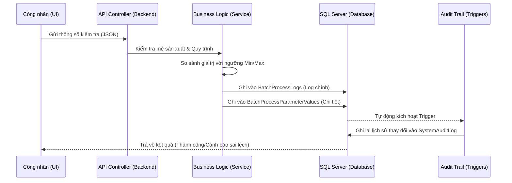

# Phân tích Luồng dữ liệu Ghi vào Database (Data Flow Analysis)

Tài liệu này mô tả chi tiết cách dữ liệu được xử lý từ lúc người công nhân nhập vào giao diện cho đến khi được lưu trữ vĩnh viễn và tạo vết kiểm tra (Audit Trail) trong cơ sở dữ liệu hệ thống GMP.

---

## 1. Sơ đồ Tổng quát (High-Level Flow)

---

## 2. Chi tiết các giai đoạn thực thi

### Giai đoạn 1: Tiếp nhận dữ liệu tại Gateway (API)

Khi công nhân nhấn "Lưu" trên ứng dụng Mobile/Web, một request `POST` được gửi đến `BatchProcessLogsController`.

- **Dữ liệu thô**: Toàn bộ nội dung form được đóng gói thành chuỗi JSON (ví dụ: `{"Nhiệt độ": 85, "Áp suất": 1.2}`).

- **Xác thực**: Hệ thống kiểm tra ID của Mẻ (`BatchId`) và ID của Bước quy trình (`RoutingId`) để đảm bảo dữ liệu được ghi đúng chỗ.

### Giai đoạn 2: Xử lý Logic và Kiểm tra Sai lệch (Deviation Check)

Đây là phần quan trọng nhất để đảm bảo tiêu chuẩn GMP:

1. **Tra cứu Quy chuẩn**: Hệ thống tìm trong bảng `StepParameters` các ngưỡng cho phép (Min/Max) của công đoạn này.

2. **So sánh**:
    - Nếu giá thực tế nằm ngoài khoảng [Min, Max], biến `IsDeviation` sẽ được đánh dấu là `True`.
    - **Kết quả**: Hệ thống vẫn cho phép lưu nhưng sẽ hiển thị cảnh báo đỏ trên hồ sơ lô điện tử.
3. **Bóc tách dữ liệu**: Thay vì chỉ lưu cục JSON, hệ thống tách từng cặp Key-Value để ghi vào bảng `BatchProcessParameterValues`. Điều này cho phép trích xuất báo cáo thông số sau này mà không cần parse lại dữ liệu phức tạp.

### Giai đoạn 3: Ghi dữ liệu xuống Database (Persistence)

Hệ thống thực hiện ghi đồng thời vào 3 bảng:

- **`BatchProcessLogs`**: Lưu bản tin tổng quát (Người thực hiện, Thời gian bắt đầu/kết thúc, Ghi chú, Trạng thái `ResultStatus`).
- **`BatchProcessParameterValues`**: Lưu danh sách các giá trị chi tiết đã bóc tách ở trên.
- **`ProductionBatches`**: Cập nhật cột `CurrentStep` (Bước hiện tại). Nếu công đoạn này là "Hoàn thành", mẻ sẽ tự động nhảy sang bước tiếp theo.

### Giai đoạn 4: Tự động ghi vết (Audit Trail)

Ngay sau khi các lệnh `INSERT/UPDATE` ở Giai đoạn 3 hoàn tất, các **Triggers** trong SQL Server sẽ tự động làm việc:

- **Trigger `trg_Recipes_Audit` & các Trigger tương tự**:

- Chụp lại giá trị cũ (OLD) và giá trị mới (NEW).
- Ghi vào bảng `SystemAuditLog` kèm theo `UserID` của người thực hiện và `Timestamp`.

- **Mục đích**: Chống gian lận dữ liệu. Ngay cả Admin cũng không thể sửa dữ liệu mà không để lại vết trong bảng Audit.

---

## 3. Bản đồ quan hệ các bảng khi ghi dữ liệu

| Tên bảng | Loại thao tác | Dữ liệu thay đổi tiêu biểu |
| :--- | :--- | :--- |
| **`BatchProcessLogs`** | INSERT/UPDATE | `OperatorId`, `ParametersData`, `IsDeviation`, `ResultStatus` |
| **`BatchProcessParameterValues`** | INSERT | `ParameterId`, `ActualValue`, `RecordedDate` |
| **`ProductionBatches`** | UPDATE | `CurrentStep`, `Status` (In-Process -> Completed) |
| **`SystemAuditLog`** | INSERT (Auto) | `TableName`, `Action`, `OldValue`, `NewValue`, `ChangedBy` |
| **`InventoryLots`** | UPDATE | `QuantityCurrent` (Nếu có xuất nguyên liệu kèm theo) |

---

## 4. Ví dụ về một bản ghi Audit Trail

Nếu công nhân sửa Nhiệt độ từ **80** thành **90**, bảng `SystemAuditLog` sẽ xuất hiện một dòng như sau:

| AuditID | TableName | RecordID | Action | OldValue | NewValue | ChangedBy |
| :--- | :--- | :--- | :--- | :--- | :--- | :--- |
| 1024 | BatchProcessParameterValues | 557 | UPDATE | `{"Value": 80}` | `{"Value": 90}` | User_01 |

---

> [!IMPORTANT]
> **Tính duy nhất và Toàn vẹn**: Hệ thống sử dụng `BatchNumber` và `OrderCode` làm khóa duy nhất để đảm bảo dữ liệu không bị ghi đè hoặc nhầm lẫn giữa các lô hàng khác nhau.
