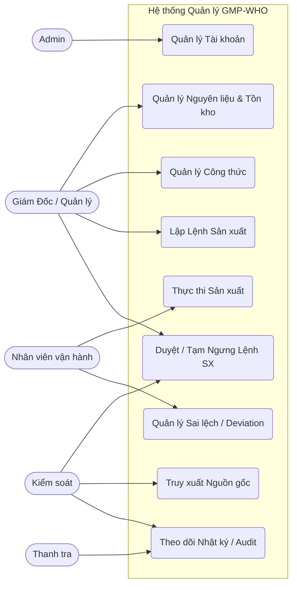
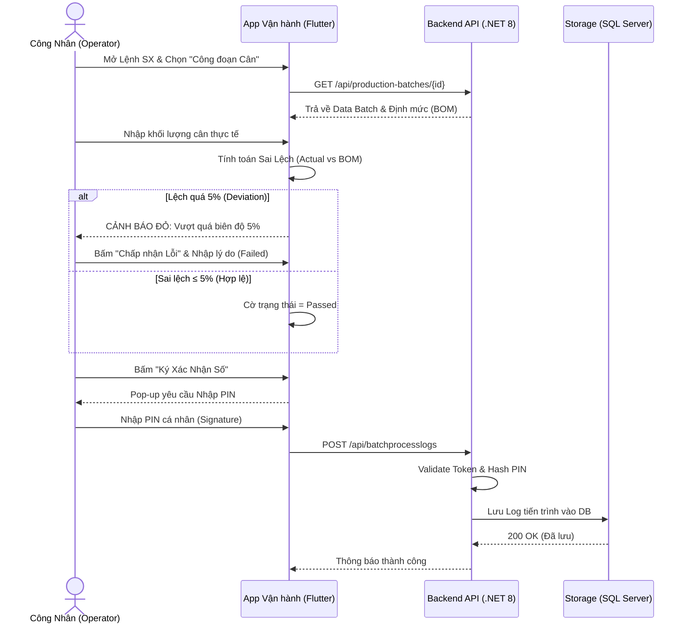
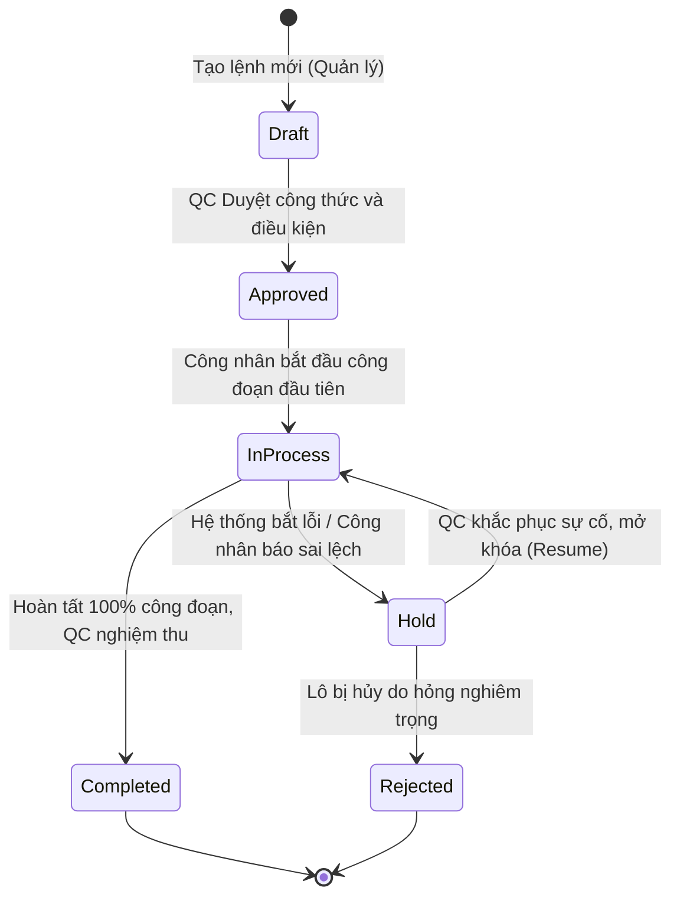
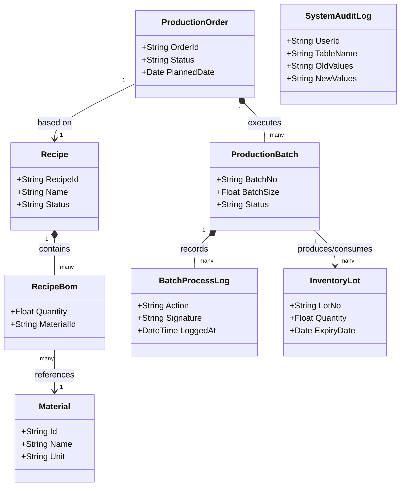
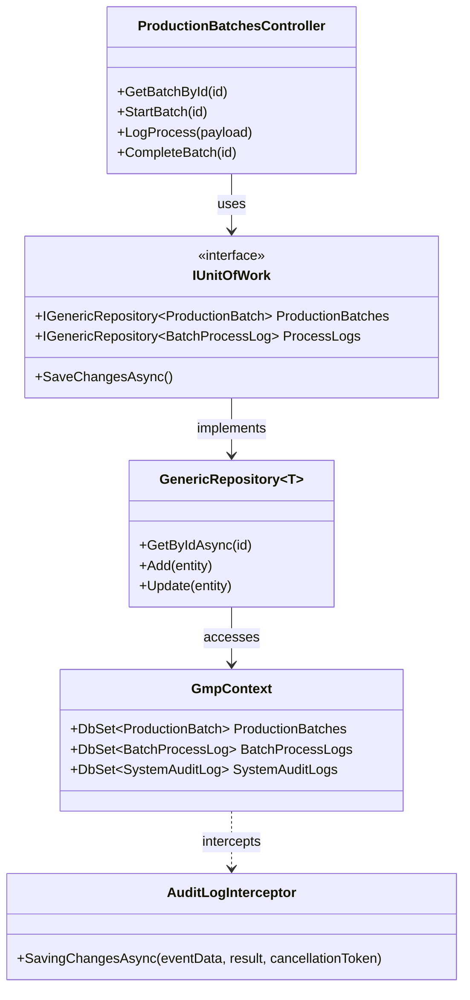
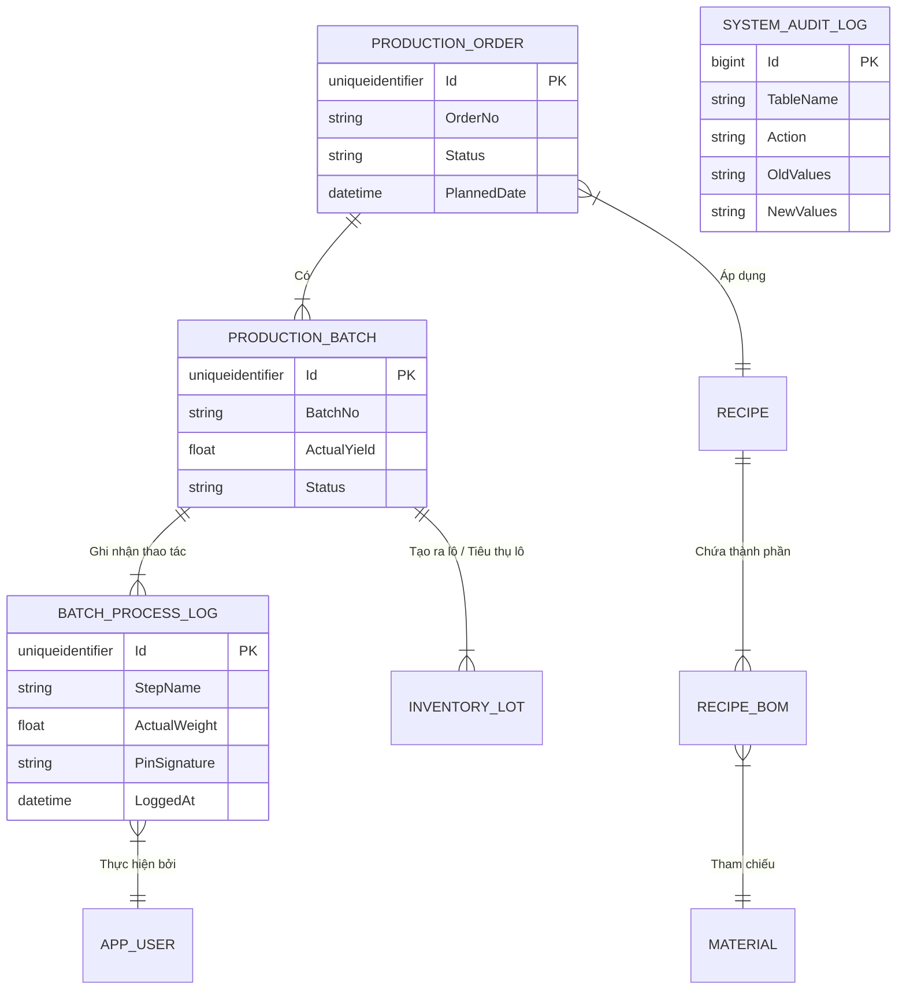

# ĐỒ ÁN TỐT NGHIỆP: XÂY DỰNG HỆ THỐNG QUẢN LÝ QUY TRÌNH CHẾ BIẾN THUỐC THEO TIÊU CHUẨN GMP-WHO

## LỜI CẢM ƠN

Chúng tôi xin chân thành cảm ơn các giảng viên hướng dẫn và tập thể Khoa Công nghệ Thông tin, Trường Đại học Công thương TP.HCM đã tận tình chỉ bảo, hỗ trợ và cung cấp nền tảng kiến thức vững chắc để nhóm hoàn thành khóa luận này.

---

## MỤC LỤC

- LỜI CẢM ƠN
- DANH MỤC CÁC KÝ HIỆU VÀ CHỮ VIẾT TẮT
- MỞ ĐẦU
  1. GIỚI THIỆU
  2. MỤC TIÊU ĐỀ TÀI
  3. ĐỐI TƯỢNG VÀ PHẠM VI ĐỀ TÀI
- CHƯƠNG 1: KHẢO SÁT HỆ THỐNG
  - 1.1. MỤC TIÊU KHẢO SÁT
  - 1.2. HIỆN TRẠNG TỔ CHỨC VÀ QUY TRÌNH NGHIỆP VỤ
    - 1.2.1. Cấu trúc vai trò (Role-based Structure)
    - 1.2.2. Đặc tả Quy trình chế biến Viên Nang
- CHƯƠNG 2: PHÂN TÍCH HỆ THỐNG
  - 2.1. Phân tích Use-case nghiệp vụ
    - 2.1.1. Sơ đồ Use-case nghiệp vụ
    - 2.1.2. Đặc tả Use-case nghiệp vụ chính
  - 2.2. Phân tích Use-case hệ thống và Đặc tả
    - 2.2.1. Sơ đồ tuần tự (Sequence Diagram) - Thực thi công đoạn trên Mobile
    - 2.2.2. Sơ đồ trạng thái (State Machine) của Lệnh Sản Xuất
  - 2.3. Sơ đồ lớp mức phân tích
    - 2.3.1. Đặc tả các lớp chính
- CHƯƠNG 3: THIẾT KẾ HỆ THỐNG
  - 3.1. Sơ đồ lớp thiết kế (Design Class Diagram)
    - 3.1.1. Đặc tả lớp thiết kế
  - 3.2. Mô hình dữ liệu (Entity-Relationship Model)
  - 3.3. Thiết kế giao diện (User Interface)
- CHƯƠNG 4: CÀI ĐẶT HỆ THỐNG
  - 4.1. Công cụ và Môi trường phát triển
  - 4.2. Tổ chức mã nguồn Frontend (Flutter & React)
  - 4.3. Cài đặt chức năng cốt lõi (Backend)
    - 4.3.1. Cơ chế Audit Trail (Lưu vết tự động) theo CFR Part 11
    - 4.3.2. Cài đặt tính năng Ký số (Digital Signature) trên Mobile
  - 4.4. Triển khai hệ thống (Deployment) bằng Docker
- CHƯƠNG 5: THỬ NGHIỆM VÀ ĐÁNH GIÁ
  - 5.1. Môi trường thử nghiệm
  - 5.2. Các kịch bản thử nghiệm (Test Cases) và Đánh giá
    - Kịch bản 1: Luồng nghiệp vụ cơ bản (Happy Path)
    - Kịch bản 2: Cơ chế cảnh báo và kiểm soát sai lệch (Deviation Control)
    - Kịch bản 3: Giám sát lưu vết (Audit Trail) theo FDA 21 CFR Part 11
  - 5.3. Đánh giá User Acceptance Testing (UAT)
- KẾT LUẬN
  1. Kết quả đạt được
  2. Hạn chế còn tồn tại
  3. Hướng phát triển tương lai
- TÀI LIỆU THAM KHẢO

---

## DANH MỤC CÁC KÝ HIỆU VÀ CHỮ VIẾT TẮT

- **GMP-WHO**: Good Manufacturing Practice - World Health Organization (Thực hành tốt sản xuất thuốc theo Tổ chức Y tế Thế giới)
- **NLC**: Nguyên liệu chính
- **TD**: Tá dược
- **BOM**: Bill of Materials (Định mức nguyên vật liệu)
- **eBMR**: Electronic Batch Manufacturing Record (Hồ sơ lô điện tử)

---

## MỞ ĐẦU

### 1. GIỚI THIỆU

Trong ngành công nghiệp Dược phẩm, tiêu chuẩn GMP-WHO (Good Manufacturing Practice - Thực hành tốt sản xuất thuốc) là quy chuẩn bắt buộc do Tổ chức Y tế Thế giới ban hành nhằm đảm bảo thuốc được sản xuất một cách đồng nhất và đạt tiêu chuẩn chất lượng. Đặc thù cốt lõi của quy trình sản xuất theo GMP là tính "có thể theo dõi" (Traceability) và "không thể chối bỏ" (Non-repudiation) đối với mọi thao tác tác động lên lô sản phẩm.

Tại nhiều nhà máy dược hiện nay, việc quản lý Hồ sơ lô sản xuất (BMR - Batch Manufacturing Record) vẫn dựa chủ yếu vào quy trình giấy tờ thủ công (Paper-based BMR). Điều này làm phát sinh nhiều "nỗi đau" (pain points) như:

- **Nguy cơ sai sót con người (Human Error):** Công nhân dễ ghi nhầm số liệu cân đo, hoặc quên ký tên xác nhận sau khi hoàn thành công đoạn.
- **Tính toán thủ công:** Việc cộng trừ sai số khối lượng bù trừ nguyên liệu dễ dẫn đến thất thoát hoặc sản phẩm không đạt hàm lượng chuẩn.
- **Tốn thời gian cho bộ phận QA/QC:** Bộ phận đảm bảo chất lượng phải mất rất nhiều thời gian để kiểm tra chéo (double-check) từng trang hồ sơ giấy trước khi xuất xưởng một lô thuốc.
- **Khó khăn trong truy xuất nguồn gốc:** Khi phát hiện một nguyên liệu đầu vào bị lỗi, việc lục lại kho hồ sơ giấy để tìm xem những lô thành phẩm nào đã sử dụng nguyên liệu đó là một "ác mộng" về mặt quản lý.

Xuất phát từ thực tiễn trên, việc xây dựng một **Hệ thống Quản lý Quy trình Chế biến Thuốc theo tiêu chuẩn GMP-WHO** dưới dạng điện tử (eBMR - Electronic Batch Manufacturing Record) là vô cùng cấp thiết. Hệ thống không chỉ giúp số hóa dữ liệu mà còn chủ động kiểm soát sai lệch ngay tại thời điểm thực thi (Real-time deviation control).

### 2. MỤC TIÊU ĐỀ TÀI

Đề án đặt ra các mục tiêu kỹ thuật và nghiệp vụ cụ thể sau:

- **Ứng dụng công nghệ đa nền tảng:** Xây dựng hệ thống hoàn chỉnh với **Web Portal** dành cho cấp Quản lý/QC (để lập kế hoạch, quản lý công thức) và **Mobile App** (dạng Tablet) dành riêng cho công nhân dưới xưởng (để xem SOP hướng dẫn, nhập liệu và ký số).
- **Chuyển đổi số Hồ sơ lô (eBMR):** Số hóa hoàn toàn quy trình chế biến thuốc, cụ thể là quy trình sản xuất Viên nang (từ bước chuẩn bị phòng, sấy, cân nguyên liệu, đến trộn khô).
- **Tự động hóa kiểm soát:** Xây dựng cơ chế phát hiện sai lệch tự động (ví dụ: cảnh báo ngay lập tức nếu khối lượng cân thực tế lệch khỏi định mức BOM quá ±5%).
- **Tuân thủ chuẩn mực FDA 21 CFR Part 11:** Đảm bảo mọi thay đổi dữ liệu trong CSDL đều được lưu vết tự động (Audit Trail) mà không thể bị xóa bỏ, và yêu cầu công nhân phải xác thực bằng Chữ ký điện tử (Mã PIN) tại các điểm kiểm soát thiết yếu.

### 3. ĐỐI TƯỢNG VÀ PHẠM VI ĐỀ TÀI

- **Đối tượng nghiệp vụ:** Quy trình chế biến sản phẩm **Viên Nang** (Cụ thể áp dụng với các thành phần như: NLC 3 - Cao khô Trinh nữ Crila, TD 8 - Tinh bột, TD 1 - Aerosil, TD 4 - Talc, TD 5 - Magnesi stearat) cùng các công đoạn máy móc tương ứng (Sấy, Cân, Trộn).
- **Phạm vi hệ thống:** Đồ án giới hạn trong phạm vi quản lý lệnh sản xuất, theo dõi tiến độ công đoạn, truy xuất nguyên liệu đầu vào, và ghi nhận Audit Trail. Chưa bao gồm hệ thống kế toán, nhân sự hay tính toán chi phí (ERP).
- **Công nghệ cốt lõi:**
  - Frontend: React (Web), Flutter (Mobile).
  - Backend: .NET 8 (C#) với Clean Architecture.
  - Cơ sở dữ liệu: SQL Server 2022.

---

## CHƯƠNG 1: KHẢO SÁT HỆ THỐNG

### 1.1. MỤC TIÊU KHẢO SÁT

Quá trình khảo sát nhằm thấu hiểu tường tận quy trình vật lý đang diễn ra dưới xưởng, từ đó ánh xạ (mapping) chính xác các thông số môi trường, thời gian thực hiện, và thiết bị vào mô hình dữ liệu (Data Model) của hệ thống eBMR.

### 1.2. HIỆN TRẠNG TỔ CHỨC VÀ QUY TRÌNH NGHIỆP VỤ

#### 1.2.1. Cấu trúc vai trò (Role-based Structure)

Quy trình sản xuất thuốc đòi hỏi phân quyền nghiêm ngặt nhằm đảm bảo nguyên tắc "bất kiêm nhiệm" trong GMP:

- **Giám đốc sản xuất / Quản lý:** Lập kế hoạch, khai báo định mức nguyên liệu (BOM) và ban hành Lệnh sản xuất (Production Order).
- **Nhân viên Kiểm soát chất lượng (QC - Quality Control):** Thẩm định môi trường phòng pha chế trước khi làm việc, đánh giá các trường hợp xảy ra sai lệch (Deviation) và đưa ra quyết định "Duyệt" (Approve) hay "Hủy" (Reject).
- **Công nhân vận hành (Operator):** Trực tiếp thao tác với máy móc tại xưởng (cân, sấy, trộn) và ghi chép lại kết quả thực tế.

#### 1.2.2. Đặc tả Quy trình chế biến Viên Nang

Dựa trên tài liệu Hồ sơ chế biến lô gốc (SOP), quy trình vật lý được mô hình hóa vào hệ thống bao gồm các điểm kiểm soát tới hạn (CCP) sau:

1. **Kiểm tra môi trường (Phòng pha chế):**
   - Trước khi sản xuất, QC phải ghi nhận thông số môi trường phòng: Nhiệt độ ($21^\circ C \sim 25^\circ C$), Độ ẩm ($45\% \sim 70\%$), và Áp lực phòng ($\ge 10 Pa$). Bất kỳ thông số nào nằm ngoài khoảng này, hệ thống sẽ chặn không cho bắt đầu lệnh sản xuất.

2. **Công đoạn 1 - Sấy nguyên liệu:**
   - **Nguyên liệu:** Sấy Tá dược 8 (Tinh bột) và NLC 3 (Cao khô Trinh nữ).
   - **Thiết bị:** Máy sấy tầng sôi `KBC-TS-50`.
   - **SOP:** Nhiệt độ sấy thiết lập ở $75^\circ C$, thời gian sấy kéo dài $180$ phút. Công nhân phải ghi nhận độ ẩm của hạt sau sấy để đảm bảo đạt tiêu chuẩn (< 5%).

3. **Công đoạn 2 - Pha chế (Cân nguyên liệu):**
   - **Thiết bị:** Hệ thống yêu cầu ghi rõ thiết bị cân để phục vụ truy xuất (Cân điện tử `IW2-60` đối với tải trọng lớn, và `PMA-5000` đối với tải trọng nhỏ).
   - **Yêu cầu:** Công nhân nhìn vào định mức lý thuyết (BOM) trên màn hình Tablet, tiến hành cân, và nhập khối lượng cân thực tế (Actual Weight).

4. **Công đoạn 3 - Trộn khô:**
   - **Thiết bị:** Máy trộn lập phương `AD-LP-200`.
   - **SOP:** Khâu này yêu cầu nạp xen kẽ NLC 3 và các tá dược thành từng lớp mỏng. Thời gian trộn phải chuẩn xác $15$ phút ở tốc độ quay $15$ vòng/phút. Bất cứ sự sai lệch nào về thời gian đều có thể làm phân lớp bột, dẫn đến hàm lượng viên thuốc không đồng đều.

---

## CHƯƠNG 2: PHÂN TÍCH HỆ THỐNG

### 2.1. Phân tích Use-case nghiệp vụ

#### 2.1.1. Sơ đồ Use-case nghiệp vụ

Hệ thống quản lý sản xuất GMP-WHO yêu cầu sự phối hợp chặt chẽ giữa nhiều bộ phận. Nguyên tắc cốt lõi là "Phân quyền tối thiểu" (Least Privilege) nhằm đảm bảo an toàn và truy xuất dữ liệu.



#### 2.1.2. Đặc tả Use-case nghiệp vụ chính

Dưới đây là đặc tả chi tiết cho 2 Use-case cốt lõi định hình quy trình vận hành sản xuất:

##### 1. Use-case: Thực thi Sản xuất (Nhân viên vận hành)

- **Mô tả:** Công nhân sử dụng Mobile App để thực hiện các bước sấy, cân, trộn theo đúng trình tự Hồ sơ lô.
- **Tiền điều kiện:** Lệnh sản xuất đang ở trạng thái `Approved` hoặc `InProcess`. Thiết bị (Tablet) đã kết nối mạng nội bộ của nhà máy.
- **Luồng sự kiện chính (Happy Path):**
  1. Công nhân chọn Lệnh sản xuất tương ứng trong ngày.
  2. Hệ thống hiển thị công đoạn cần làm tiếp theo (ví dụ: Cân nguyên liệu NLC 3).
  3. Công nhân tiến hành cân, nhập khối lượng thực tế đọc được từ cân IW2-60 vào hệ thống.
  4. Hệ thống kiểm tra: Khối lượng thực tế nằm trong biên độ $\pm 5\%$ so với định mức (BOM).
  5. Công nhân bấm hoàn tất, hệ thống yêu cầu nhập mã PIN chữ ký số.
  6. Lưu thành công, chuyển sang công đoạn tiếp theo.
- **Luồng ngoại lệ (Alternative Flow - Xử lý sai lệch):**
  - Tại bước 4, nếu khối lượng nhập vào chênh lệch quá 5%, hệ thống cảnh báo đỏ.
  - Công nhân không thể đi tiếp bằng luồng thông thường. Bắt buộc chọn "Báo cáo sai lệch" (Report Deviation) và nhập lý do.
  - Sau khi ký PIN, trạng thái lô chuyển sang `Hold`. Lệnh sản xuất bị tạm ngưng và gửi thông báo khẩn đến QC.

##### 2. Use-case: Duyệt / Tạm ngưng / Xử lý sai lệch (Quản lý / QC)

- **Mô tả:** QC theo dõi Lệnh sản xuất trên Web Portal. Nếu mọi thứ bình thường, QC cho phép lệnh tiếp tục. Nếu phát hiện sai lệch môi trường hoặc do công nhân báo cáo lỗi (Hold), QC phải trực tiếp điều tra.
- **Luồng xử lý Hold:**
  1. Nhận được thông báo Lô đang ở trạng thái `Hold`.
  2. QC xuống xưởng kiểm tra thực tế (ví dụ: phát hiện cân IW2-60 bị hỏng cảm biến).
  3. QC đưa ra quyết định trên hệ thống:
     - Chọn `Resume` (Tiếp tục) nếu sai số được khắc phục.
     - Chọn `Reject` (Hủy lô) nếu lô thuốc đã bị hỏng hoàn toàn.
  4. Mọi thao tác giải quyết `Hold` đều bị ghi lưu vết cứng (Hard-Audit) vào CSDL.

### 2.2. Phân tích Use-case hệ thống và Đặc tả

#### 2.2.1. Sơ đồ tuần tự (Sequence Diagram) - Thực thi công đoạn trên Mobile

Công nhân thao tác trên ứng dụng Mobile (Flutter) để thực hiện công đoạn Cân nguyên liệu. Sơ đồ dưới đây minh họa sự tương tác liên tục giữa thiết bị Mobile, Backend API và cơ chế lưu vết tại Database.



#### 2.2.2. Sơ đồ trạng thái (State Machine) của Lệnh Sản Xuất

Lệnh sản xuất trong GMP không cho phép nhảy cóc (skip) hoặc lùi lại tự do. Vòng đời của Lệnh sản xuất được biểu diễn nghiêm ngặt bằng sơ đồ trạng thái (State Diagram) như sau:



**Quy tắc ràng buộc trạng thái:**

- Dữ liệu định mức (BOM) chỉ được phép chỉnh sửa khi ở trạng thái `Draft`. Một khi đã chuyển sang `Approved`, hệ thống kích hoạt cơ chế Data Locking (khóa dữ liệu) đối với công thức.
- Từ trạng thái `Completed`, không có bất kỳ quyền nào (ngay cả Admin) có thể quay ngược lại `InProcess` để sửa khối lượng cân. Nếu phát hiện sai sót sau khi Completed, hệ thống bắt buộc phải tạo Lệnh điều tra (Investigation) tách biệt theo SOP nội bộ.

### 2.3. Sơ đồ lớp mức phân tích

Hệ thống được phân tích thành các thực thể dữ liệu chính tập trung vào ba luồng cốt lõi: Quản lý Công thức (Recipe), Quản lý Sản xuất (Production) và Truy xuất nguồn gốc (Traceability).



#### 2.3.1. Đặc tả các lớp chính

- **Recipe & RecipeBom (Định mức nguyên liệu):** Khai báo các thành phần công thức (ví dụ: NLC 3, TD 1, 3, 4, 5, 8 đối với Viên Nang). Đây là gốc dữ liệu dùng để tính toán sai lệch khối lượng cân (biên độ ±5%).
- **ProductionOrder & ProductionBatch (Lệnh & Lô sản xuất):** Quản lý trạng thái thực thi. Khi `ProductionOrder` chuyển sang Approved, các tham số từ `Recipe` sẽ được snapshot (Data Locking) sang để ngăn chặn sửa đổi (đảm bảo tính bất biến GMP).
- **BatchProcessLog (Nhật ký công đoạn):** Lưu vết các thao tác của công nhân tại từng máy (cân IW2-60, máy trộn AD-LP-200) với chữ ký số (Mã PIN) và ghi nhận thông số môi trường (nhiệt độ, độ ẩm).
- **InventoryLot (Lô tồn kho):** Thực thể cốt lõi cho phép Traceability (Truy xuất nguồn gốc) hai chiều từ thành phẩm ngược về nguyên liệu.
- **SystemAuditLog:** Lưu vết lịch sử của mọi sự thay đổi (INSERT, UPDATE) ở tầng cơ sở dữ liệu để đáp ứng tiêu chuẩn 21 CFR Part 11.

---

## CHƯƠNG 3: THIẾT KẾ HỆ THỐNG

### 3.1. Sơ đồ lớp thiết kế (Design Class Diagram)

Kiến trúc Backend được thiết kế theo mô hình **Clean Architecture** kết hợp **Repository Pattern** trên nền tảng .NET 8. Việc sử dụng Clean Architecture giúp hệ thống tuân thủ chặt chẽ nguyên lý Dependency Inversion, tách biệt hoàn toàn Core Domain (nghiệp vụ dược) khỏi các phụ thuộc hạ tầng (Database, Framework), từ đó nâng cao tính khả thử (Testability) và khả năng mở rộng. Sơ đồ dưới đây tập trung vào luồng xử lý Lô sản xuất (Production Batch).



#### 3.1.1. Đặc tả lớp thiết kế

- **ProductionBatchesController:** Điểm vào API (Endpoint) nhận các request từ Mobile App. Controller này được bảo vệ bởi **JWT Authentication** và cơ chế phân quyền (Authorization) Role-based. Chỉ user có role "Operator" mới gọi được API `LogProcess`.
- **IUnitOfWork & GenericRepository:** Đóng gói logic truy xuất Database. `IUnitOfWork` đảm bảo các transaction thay đổi nhiều bảng cùng lúc (ví dụ: trừ tồn kho và ghi log) được thực hiện một cách nguyên tử (Atomic).
- **AuditLogInterceptor:** Một middleware can thiệp vào tầng Entity Framework Core. Bất cứ khi nào `SaveChangesAsync()` được gọi, Interceptor này sẽ kích hoạt trước tiên để chụp lại (snapshot) thay đổi.

### 3.2. Mô hình dữ liệu (Entity-Relationship Model)

Cơ sở dữ liệu SQL Server 2022 được chuẩn hóa nhằm loại bỏ dư thừa, đồng thời triển khai kỹ thuật **Soft Delete** (IsDeleted = true) cho hầu hết các bảng cấu hình để tránh mất mát dữ liệu tham chiếu trong các lệnh sản xuất cũ.



_Lưu ý: Bảng `SYSTEM_AUDIT_LOG` được thiết kế hoàn toàn cô lập, không có khóa ngoại (Foreign Key) tham chiếu đến bất kỳ bảng nào khác. Điều này nhằm ngăn chặn lỗi vòng lặp (cascade loop) hoặc việc dữ liệu log bị xóa nhầm khi các record ở bảng gốc bị xóa cứng. Thay vào đó, nó lưu giá trị ID dạng chuỗi JSON._

### 3.3. Thiết kế giao diện (User Interface)

Hệ thống triển khai 2 nền tảng với giao diện tối ưu cho từng điều kiện môi trường làm việc:

1. **Web Admin (Dành cho Quản lý & QC - ReactJS):**
   - **Môi trường:** Máy tính văn phòng, kết nối mạng LAN ổn định.
   - **Giao diện Dashboard:** Hiển thị biểu đồ tiến độ dạng Kanban cho các lệnh sản xuất. Có biểu diễn trực quan các mẻ đang bị `Hold` để QC ưu tiên xử lý.
   - **Giao diện Lập lệnh SX:** Xây dựng form động với thuật toán scale (tự động nhân chia tỷ lệ BOM theo cỡ lô mong muốn), giảm tải việc kỹ sư phải tính tay.
2. **Mobile App (Dành cho Công nhân - Flutter):**
   - **Môi trường:** Màn hình cảm ứng (Tablet) đặt tại phòng pha chế, người dùng có thể đang đeo găng tay cao su.
   - **Màn hình Dynamic Step (eBMR):** Giao diện chia thành dạng Wizard (từng bước). Chữ to, nút bấm lớn, độ tương phản cao. SOP được hiển thị thường trực trên màn hình.
   - **Màn hình Cảnh báo & Ký số:** Bàn phím số (Numpad) ảo lớn chiếm nửa màn hình. Khi có lỗi (sai số cân), hệ thống dùng hiệu ứng rung (Haptic feedback) và viền đỏ nhấp nháy liên tục để cảnh báo mạnh mẽ.

---

## CHƯƠNG 4: CÀI ĐẶT HỆ THỐNG

### 4.1. Công cụ và Môi trường phát triển

Dự án được xây dựng dựa trên các công nghệ hiện đại, kết hợp chặt chẽ giữa tính bảo mật của Doanh nghiệp và tính linh hoạt của Mobile:

- **Backend:** C# 12 (.NET 8 Web API) với Entity Framework Core.
- **Frontend (Web Portal):** React (TypeScript), giao tiếp với API thông qua Axios.
- **Mobile App:** Flutter (Dart).
- **Hệ quản trị CSDL:** SQL Server 2022.
- **Công cụ Code Intelligence:** Sử dụng GitNexus để theo dõi luồng dữ liệu (Data Flow) và kiểm soát rủi ro (Impact Analysis) trong suốt quá trình phát triển (đảm bảo không phá vỡ logic khi refactor lệnh `Hold`).

### 4.2. Tổ chức mã nguồn Frontend (Flutter & React)

- **Kiến trúc Flutter:** Ứng dụng Mobile sử dụng kiến trúc phân tầng UI - Logic rõ ràng thông qua `Provider` (hoặc `BLoC`). Việc tách biệt `ApiService` chuyên gửi request HTTP và `AuthProvider` chuyên quản lý session JWT giúp ứng dụng không bị phụ thuộc vòng.
- **Quản lý trạng thái lệnh (Workflow):** Trên Flutter, các Tab (`Draft`, `InProcess`, `Completed`) được nạp dữ liệu động từ API. Khi một bước pha chế hoàn tất, App tự động trigger luồng refresh data để đẩy Lệnh sản xuất sang trạng thái tiếp theo.

### 4.3. Cài đặt chức năng cốt lõi (Backend)

#### 4.3.1. Cơ chế Audit Trail (Lưu vết tự động) theo CFR Part 11

Để đáp ứng chuẩn GMP, thao tác CUD (Create, Update, Delete) phải bị giám sát ở mức sâu nhất (Database level). Việc sử dụng `SaveChangesInterceptor` của Entity Framework là giải pháp tối ưu, loại bỏ hoàn toàn rủi ro Lập trình viên "quên" gọi hàm ghi log.

_Đoạn mã cốt lõi mô phỏng hoạt động của AuditLogInterceptor:_

```csharp
public override async ValueTask<InterceptionResult<int>> SavingChangesAsync(
    DbContextEventData eventData, InterceptionResult<int> result, CancellationToken cancellationToken)
{
    var context = eventData.Context;
    var auditEntries = new List<SystemAuditLog>();

    // Quét toàn bộ các Entity đang bị thay đổi trong ChangeTracker
    foreach (var entry in context.ChangeTracker.Entries().Where(e => e.State == EntityState.Added || e.State == EntityState.Modified || e.State == EntityState.Deleted))
    {
        var auditEntry = new SystemAuditLog
        {
            TableName = entry.Metadata.GetTableName(),
            Action = entry.State.ToString(),
            UserId = _currentUserService.UserId, // Lấy từ JWT Context
            LoggedAt = DateTime.UtcNow
        };
        // Serialize giá trị cũ/mới ra JSON
        if (entry.State == EntityState.Modified)
        {
            auditEntry.OldValues = JsonSerializer.Serialize(entry.OriginalValues.ToObject());
            auditEntry.NewValues = JsonSerializer.Serialize(entry.CurrentValues.ToObject());
        }
        auditEntries.Add(auditEntry);
    }

    // Ghi audit vào DB trong cùng 1 transaction
    context.Set<SystemAuditLog>().AddRange(auditEntries);
    return await base.SavingChangesAsync(eventData, result, cancellationToken);
}
```

#### 4.3.2. Cài đặt tính năng Ký số (Digital Signature) trên Mobile

Trong màn hình eBMR, khi công nhân nhấn "Ký xác nhận", họ nhập mã PIN 6 số. API `POST /api/batchprocesslogs` sẽ nhận payload.
Tại Backend, hệ thống thực hiện hai lớp xác thực:

1. Xác thực Authentication từ JWT Token ở Header (Biết công nhân là ai).
2. Mã hóa (Hashing) mã PIN từ request, đối chiếu với trường `PinHash` trong bảng `AppUser` của CSDL. Nếu trùng khớp, logic kiểm tra sai lệch (±5%) mới được tính hợp lệ và commit xuống DB.

### 4.4. Triển khai hệ thống (Deployment) bằng Docker

Nhằm loại bỏ hoàn toàn vấn đề "chạy được trên máy dev nhưng lỗi trên máy khách", dự án được container-hóa hoàn toàn bằng Docker.

- **Backend Container:** Chạy image `mcr.microsoft.com/dotnet/aspnet:8.0`.
- **Database Container:** Chạy image `mcr.microsoft.com/mssql/server:2022-latest`.
- **Cấu hình Encoding UTF-8:** CSDL được thiết lập chuẩn Collation và mã hóa UTF-8 (Codepage 65001). Điều này đảm bảo các từ khóa chuyên ngành tiếng Việt (như "Viên nang", "Cao khô Trinh nữ") khi hiển thị trên Mobile và Web không bị lỗi font rác chữ.
  Quá trình khởi chạy toàn bộ hệ sinh thái chỉ cần một lệnh duy nhất thông qua `docker-compose up -d`.

---

## CHƯƠNG 5: THỬ NGHIỆM VÀ ĐÁNH GIÁ

### 5.1. Môi trường thử nghiệm

Để đảm bảo kết quả kiểm thử sát với thực tế nhà máy nhất, hệ thống được thiết lập trên môi trường ảo hóa đóng gói:

- **Phần cứng Server:** Máy chủ ảo hóa (RAM 16GB, 4 vCPU) chạy Docker Engine trên nền tảng Linux.
- **Phần cứng Client:** Máy tính bảng Android (Màn hình 10-inch, độ phân giải 1280x800) dùng cho công nhân tại xưởng pha chế; Laptop Windows/Mac dùng trình duyệt Chrome/Edge cho Web Admin.
- **Dữ liệu mẫu (Seed Data):** Hệ thống được khởi tạo sẵn với danh mục 50+ nguyên liệu (NLC 3, TD 1, 3, 4, 5, 8...), thông tin thiết bị (Cân IW2-60, Máy trộn AD-LP-200) và 5 công thức sản xuất mẫu của Viên Nang.

### 5.2. Các kịch bản thử nghiệm (Test Cases) và Đánh giá

#### Kịch bản 1: Luồng nghiệp vụ cơ bản (Happy Path)

- **Mô tả:** Đánh giá luồng chảy dữ liệu xuyên suốt. Admin lập lệnh sản xuất $\rightarrow$ Manager duyệt lệnh $\rightarrow$ Công nhân thực thi các bước Cân, Sấy, Trộn $\rightarrow$ QC xác nhận hoàn tất.
- **Kết quả mong đợi:** Lệnh sản xuất di chuyển đúng qua các trạng thái `Draft` $\rightarrow$ `Approved` $\rightarrow$ `InProcess` $\rightarrow$ `Completed`. Các bước công đoạn trên Tablet được mở khóa tuần tự (Không thể làm bước Trộn nếu chưa Cân xong).
- **Kết quả thực tế:** Pass 100%. Hệ thống chặn thành công các nỗ lực vượt rào công đoạn. Chữ ký số (PIN) được yêu cầu đúng lúc và lưu vết thành công xuống DB với độ trễ (Latency) $\le 200ms$.

#### Kịch bản 2: Cơ chế cảnh báo và kiểm soát sai lệch (Deviation Control)

- **Mô tả:** Đánh giá khả năng bẫy lỗi thời gian thực. Công nhân cố tình nhập khối lượng cân thực tế vượt quá biên độ $\pm5\%$ so với định mức BOM lý thuyết (Ví dụ: BOM yêu cầu 100kg, thực tế nhập 106kg).
- **Kết quả mong đợi:** Ứng dụng Mobile khóa nút "Tiếp tục", hiển thị cảnh báo đỏ và yêu cầu người dùng xác nhận lỗi (Override) kèm theo lý do bắt buộc. Sau đó ghi nhận Lệnh ở trạng thái `Hold`.
- **Kết quả thực tế:** Pass 100%. Ứng dụng phản hồi rung (Haptic) và nháy viền đỏ ngay khi blur khỏi ô nhập liệu. Sau khi nhập lý do và ký PIN, trạng thái lô chuyển ngay sang `Hold` và gửi Notification realtime đến Web Portal của QC.

#### Kịch bản 3: Giám sát lưu vết (Audit Trail) theo FDA 21 CFR Part 11

- **Mô tả:** Quản lý cố tình thay đổi định mức khối lượng (Quantity) trong một công thức (Recipe) đã tồn tại. Thử xóa một người dùng khỏi hệ thống.
- **Kết quả mong đợi:** Bảng `SYSTEM_AUDIT_LOG` phải ghi nhận chính xác hành động `Update` và `Delete`. Cấu trúc JSON lưu đúng `OldValues` và `NewValues`.
- **Kết quả thực tế:** Pass 100%. `AuditLogInterceptor` hoạt động hoàn hảo ở tầng ngầm. Kể cả khi có lỗi xảy ra ở Middleware tầng trên, Transaction DB vẫn đảm bảo tính nguyên tử (Không cập nhật thành công nếu không ghi được Log).

### 5.3. Đánh giá User Acceptance Testing (UAT)

Trong buổi nghiệm thu giả định với người dùng cuối (Sinh viên đóng vai Công nhân và QC):

- **Ưu điểm:** Giao diện Mobile to, rõ ràng, dễ thao tác trên Tablet. Luồng Wizard từng bước giúp công nhân không bị ngợp thông tin.
- **Nhược điểm phát hiện:** Đôi khi công nhân quên không log-out, dẫn đến người ca sau vô tình dùng nhầm tài khoản ca trước để ký PIN (Dù PIN sai sẽ bị chặn, nhưng vẫn gây ra log rác `LoginFailed`). Cần bổ sung tính năng Auto-logout sau 15 phút rảnh (Idle).

---

## KẾT LUẬN

### 1. Kết quả đạt được

Đồ án đã nghiên cứu và phát triển thành công **"Hệ thống Quản lý Quy trình Chế biến Thuốc GMP-WHO"**, giải quyết triệt để bài toán số hóa hồ sơ lô sản xuất (eBMR) tại các nhà máy Dược phẩm. Những đóng góp chính của đề tài bao gồm:

- **Tin học hóa quy trình cốt lõi:** Chuyển đổi thành công quy trình giấy tờ thủ công sang nền tảng số đa thiết bị (Web & Mobile), giảm thiểu tối đa rủi ro sai sót con người trong việc tính toán và ghi chép thông số kỹ thuật.
- **Thiết kế tuân thủ tiêu chuẩn Quốc tế:** Ứng dụng thành công các tiêu chuẩn khắt khe của GMP và FDA (21 CFR Part 11) thông qua cơ chế Data Locking, Digital Signature (Ký số PIN) và hệ thống Audit Trail tự động ở tầng Database.
- **Kiến trúc phần mềm hiện đại, bền vững:** Việc áp dụng Clean Architecture kết hợp Repository Pattern cho Backend (.NET 8) và mô hình BLoC/Provider cho Mobile (Flutter) tạo ra một hệ thống có độ liên kết lỏng (loose coupling), dễ dàng Unit Test và sẵn sàng mở rộng các quy trình mới (Đóng gói, Ép vỉ) trong tương lai.

### 2. Hạn chế còn tồn tại

Mặc dù đã hoàn thiện luồng nghiệp vụ cơ bản, hệ thống vẫn mang một số giới hạn nhất định:

- **Chưa tự động hóa thu thập dữ liệu (Manual Data Entry):** Hiện tại công nhân vẫn phải đọc số liệu trên cân và nhập tay vào Tablet. Dù hệ thống có cảnh báo sai lệch, nguy cơ "nhập sai số" vẫn hiện hữu.
- **Thiếu tính năng Đồng bộ ngoại tuyến (Offline Sync):** Trong điều kiện mạng Wi-Fi tại xưởng sản xuất không ổn định do vách ngăn cách ly, ứng dụng Mobile hiện tại chưa thể hoạt động mượt mà ở chế độ Offline (lưu tạm vào SQLite và đồng bộ lên Server sau).

### 3. Hướng phát triển tương lai

Để biến đồ án thành một giải pháp phần mềm cấp doanh nghiệp (Enterprise-level) hoàn chỉnh, các định hướng phát triển tiếp theo bao gồm:

- **Tích hợp IoT (Internet of Things):** Xây dựng module kết nối trực tiếp qua cổng COM/RS232 hoặc giao thức TCP/IP tới các thiết bị phần cứng (cân điện tử IW2-60, máy trộn) và hệ thống SCADA. Điều này sẽ giúp tự động nạp dữ liệu môi trường và khối lượng cân vào hệ thống mà không cần sự can thiệp của con người.
- **Triển khai AI dự báo (Predictive AI):** Áp dụng các mô hình Học máy (Machine Learning) để phân tích tập dữ liệu từ các lô bị `Hold` hoặc sai lệch, từ đó đưa ra cảnh báo sớm về chu kỳ bảo trì thiết bị hoặc chất lượng nguyên liệu đầu vào có xu hướng suy giảm.

---

## TÀI LIỆU THAM KHẢO

1. Tổ chức Y tế Thế giới (WHO). (2014). _Hướng dẫn Thực hành tốt sản xuất (GMP) dược phẩm_.
2. Cục Quản lý Thực phẩm và Dược phẩm Hoa Kỳ (FDA). _21 CFR Part 11 - Electronic Records; Electronic Signatures_.
3. Microsoft Corporation. (2024). _Official Documentation for .NET 8 and Entity Framework Core_.
4. Tài liệu nội bộ. _Hồ sơ chế biến lô: Quy trình sản xuất viên nang cứng_.
5. Tài liệu phân tích GitNexus Code Intelligence.
