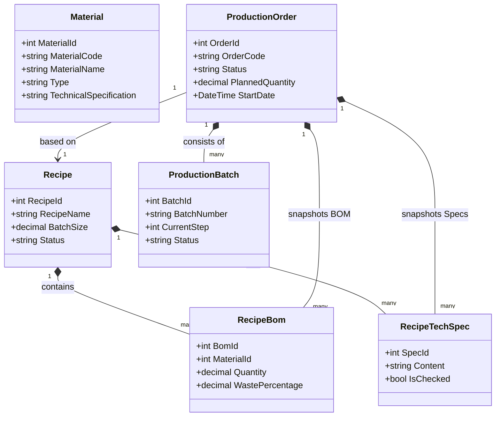
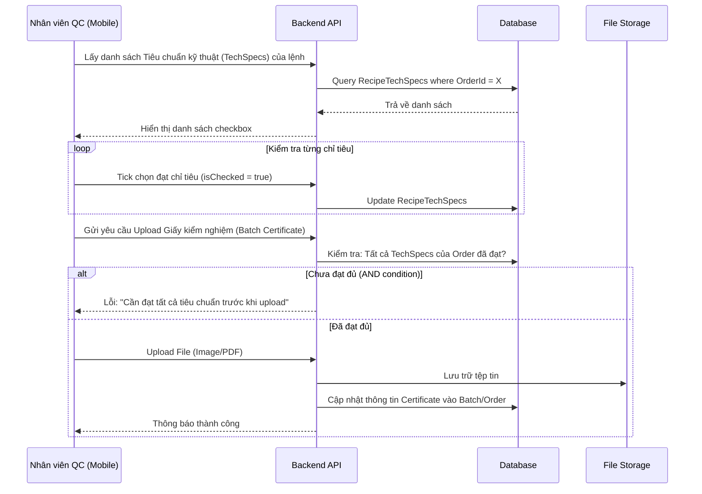
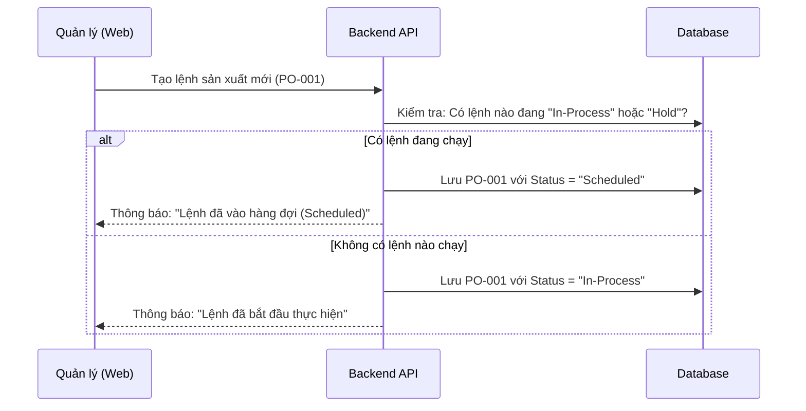

# Tài liệu Mô tả Nghiệp vụ và Tính năng Hệ thống Quản lý Sản xuất GMP

## 1. Tổng quan hệ thống
Hệ thống **GMP_System (Pharmaceutical Processing Management System)** là một giải pháp chuyển đổi số toàn diện cho quy trình sản xuất dược phẩm, tuân thủ các tiêu chuẩn nghiêm ngặt của **GMP (Good Manufacturing Practice)**. Hệ thống giúp quản lý từ khâu lập công thức, quản lý nguyên vật liệu, điều phối lệnh sản xuất đến kiểm soát chất lượng đầu ra.

---

## 2. Các tác nhân và vai trò (Actors & Roles)

| Tác nhân | Mô tả vai trò |
| :--- | :--- |
| **Quản lý sản xuất (Manager)** | Quản lý danh mục nguyên liệu, thiết lập công thức (Master Recipe), lập lệnh sản xuất (Production Order), giám sát tiến độ thời gian thực. |
| **Nhân viên Kiểm định (QC)** | Kiểm tra các chỉ tiêu kỹ thuật của từng mẻ sản xuất, phê duyệt bắt đầu lệnh tiếp theo (QC Gating), tải lên giấy chứng nhận kiểm nghiệm (COA). |
| **Nhân viên vận hành (Operator)** | Cập nhật tiến độ thực hiện từng công đoạn (Routing Steps) trên giao diện Mobile/Tablet tại xưởng sản xuất. |
| **Quản trị viên (Admin)** | Quản lý người dùng, phân quyền hệ thống, danh mục khu vực (Area) và thiết bị (Equipment). |

---

## 3. Mô tả các nghiệp vụ cốt lõi

### 3.1. Nghiệp vụ Quản lý Công thức (Recipe Management)
*   **Thiết lập BOM (Bill of Materials):** Quản lý định mức nguyên liệu cho từng đơn vị sản phẩm.
*   **Logic loại trừ Bao bì:** Các nguyên liệu là bao bì (như "Vỏ nang cứng", "Ống", "Màng PVC") được hệ thống nhận diện tự động. Chúng không tham gia vào tính toán tỉ lệ (%) khối lượng tịnh của bột thuốc nhưng vẫn được tính toán số lượng cấp phát và trừ tồn kho (ví dụ: 1 viên thuốc cần 1 vỏ nang).
*   **Quy trình công đoạn (Routing):** Thiết lập trình tự các bước sản xuất (Trộn bột -> Xát hạt -> Sấy -> Đóng nang...). Mỗi bước gắn liền với thiết bị, khu vực và các thông số cài đặt (Nhiệt độ, độ ẩm, áp suất).

### 3.2. Nghiệp vụ Lập và Điều phối Lệnh sản xuất (Production Planning)
*   **Cơ chế Hàng đợi (Queue Logic):** 
    *   Hệ thống áp dụng quy tắc: Tại một thời điểm, trên một dây chuyền sản xuất chỉ có 1 lệnh ở trạng thái **In-Process**.
    *   Lệnh mới tạo sẽ mặc định ở trạng thái **Scheduled** nếu dây chuyền đang bận.
*   **Cơ chế Snapshot:** Khi lệnh sản xuất được xác nhận, hệ thống sẽ "chụp ảnh" toàn bộ Công thức và Công đoạn tại thời điểm đó lưu vào lệnh. Điều này đảm bảo tính ổn định: nếu Master Recipe thay đổi sau này, các lệnh đang chạy vẫn thực hiện theo đúng công thức lúc lập lệnh.

### 3.3. Nghiệp vụ Kiểm soát Chất lượng (QC Gating)
Đây là "chốt chặn" quan trọng nhất trong hệ thống:
*   **Điều kiện AND cho Tiêu chuẩn kỹ thuật:** Mỗi công thức có các chỉ tiêu kỹ thuật (RecipeTechSpecs). QC phải tích xác nhận đạt **TẤT CẢ** các chỉ tiêu này trên thiết bị di động thì hệ thống mới mở khóa tính năng tải ảnh Giấy kiểm nghiệm.
*   **Phê duyệt chuyển trạng thái:** Lệnh sản xuất chỉ được chuyển từ **Scheduled** sang **In-Process** sau khi QC đã kiểm duyệt lệnh trước đó hoàn tất và xác nhận lệnh tiếp theo đủ điều kiện bắt đầu.

### 3.4. Nghiệp vụ Theo dõi Vận hành (Production Tracking)
*   **Ghi chép công đoạn:** Nhân viên vận hành cập nhật trạng thái "Bắt đầu/Hoàn thành" cho từng mẻ (Batch) tại từng công đoạn.
*   **Giám sát trực quan:** Quản lý có thể xem bảng tiến độ tổng thể, biết chính xác mẻ số mấy đang ở công đoạn nào dưới dạng văn bản (ví dụ: `Mẻ 01: Xong`, `Mẻ 02: Đang làm`).

---

## 4. Thiết kế Hệ thống (System Design)

### 4.1. Sơ đồ lớp mức thiết kế (Design Class Diagram)

### 4.2. Sơ đồ tuần tự: Phê duyệt QC và Tải chứng chỉ (QC Gate Sequence)

### 4.3. Sơ đồ tuần tự: Cơ chế Hàng đợi Sản xuất (Queue Flow)

---

## 5. Đặc điểm kỹ thuật nổi bật

1.  **Tính nhất quán dữ liệu (Immutability):** Sau khi lệnh sản xuất được khởi tạo, mọi dữ liệu về BOM và Quy trình được đóng gói (Snapshot). Điều này ngăn chặn sai sót dây chuyền khi có thay đổi công thức gốc trong lúc sản xuất đang diễn ra.
2.  **Kiểm soát chất lượng AND:** Ép buộc quy trình QC phải thực hiện kiểm tra đầy đủ (Full Check) trước khi cho phép xuất xưởng hoặc tải lên bằng chứng chất lượng.
3.  **Tự động hóa tồn kho:** Hệ thống tự động trừ kho nguyên liệu dựa trên thực tế sản xuất và hệ số hao hụt (Waste Percentage) được thiết lập trong công thức.
4.  **Bảo mật & Phân quyền:** Sử dụng cơ chế Token-based (JWT) kết hợp với phân quyền vai trò (Role-based Access Control) chặt chẽ giữa các bộ phận: Quản lý, QC và Sản xuất.

---
*Tài liệu này được biên soạn dựa trên cấu trúc codebase thực tế và các tài liệu đặc tả nghiệp vụ của dự án DoAnTotNghiep.*
