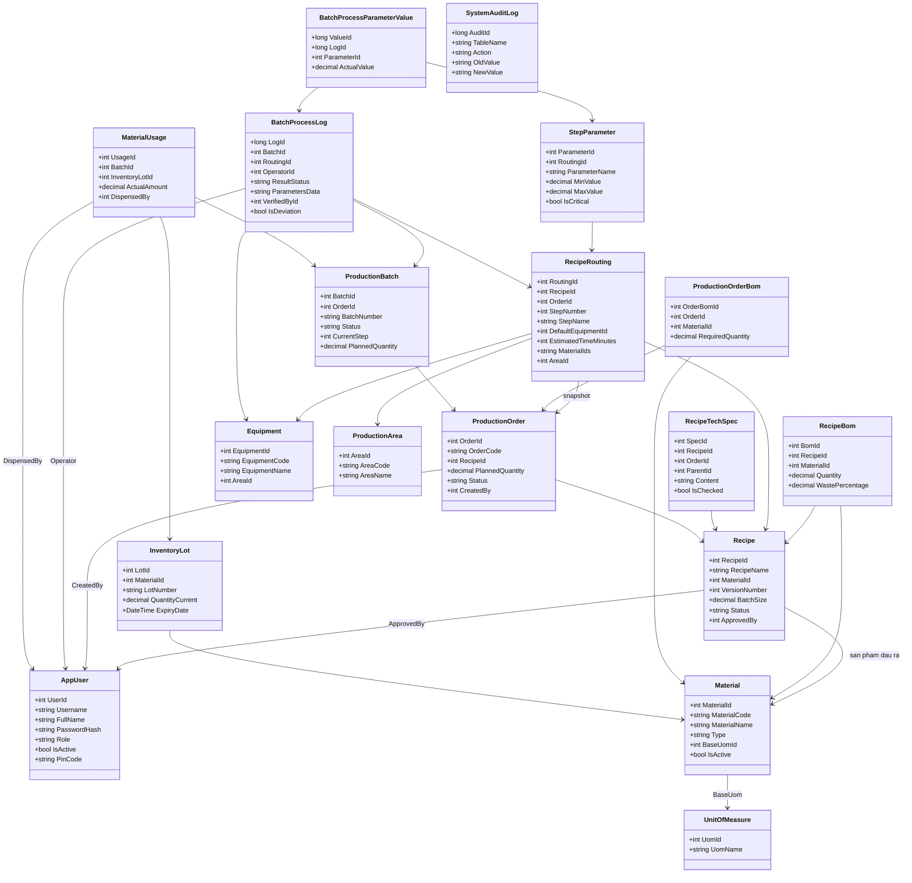
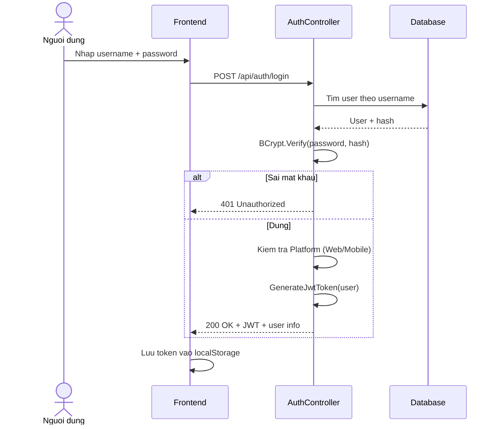
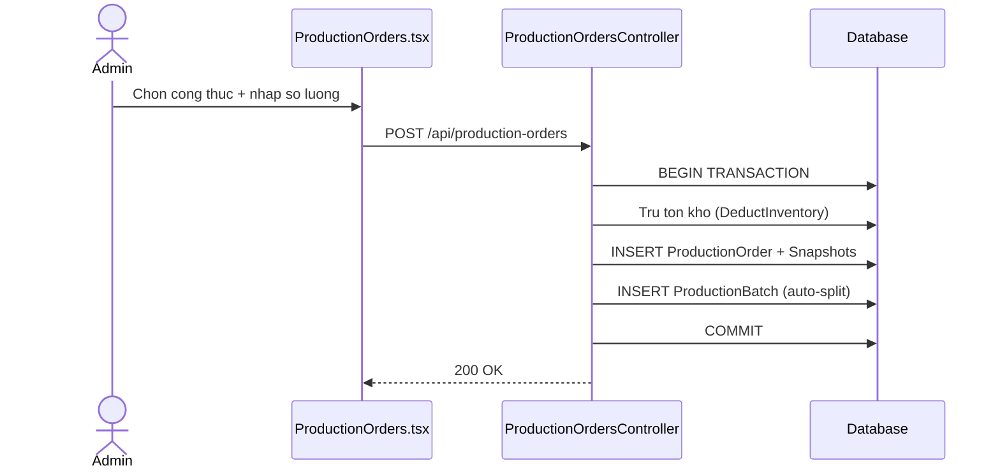

# TÀI LIỆU KỸ THUẬT HỆ THỐNG QUẢN LÝ SẢN XUẤT DƯỢC PHẨM (GMP-WHO)

## 1. Tổng quan hệ thống

### 1.1 Mục tiêu
Xây dựng hệ thống quản lý quy trình sản xuất dược phẩm tuân thủ tiêu chuẩn GMP-WHO, bao gồm: quản lý công thức, lệnh sản xuất, theo dõi mẻ sản xuất, kiểm soát chất lượng (QC), quản lý kho nguyên liệu và truy xuất nguồn gốc.

### 1.2 Kiến trúc

| Tầng | Công nghệ |
|------|-----------|
| Frontend Web | React + Vite + TypeScript + TailwindCSS |
| Frontend Mobile | Flutter |
| Backend API | .NET 8 Web API (RESTful) |
| Database | SQL Server (MSSQL) |
| Auth | JWT Bearer Token + BCrypt |
| Deploy | Docker Compose (nginx + API + DB) |

### 1.3 Phân quyền người dùng

| Vai trò | Mô tả | Nền tảng |
|---------|-------|----------|
| **Admin** | Quản trị toàn bộ hệ thống | Web |
| **ProductionManager** | Quản lý lệnh sản xuất, theo dõi tiến độ | Web + Mobile |
| **QA_QC** | Kiểm tra chất lượng, xác nhận tiêu chuẩn kỹ thuật | Mobile |
| **Operator** | Vận hành sản xuất: ghi nhận thông số công đoạn | Mobile |

---

## 2. Sơ đồ lớp mức thiết kế (Class Diagram)

---

## 3. Danh sách các Nghiệp vụ chính

| # | Nghiệp vụ | Actor chính |
|---|-----------|-------------|
| NV01 | Xác thực và phân quyền | Tất cả |
| NV02 | Quản lý nguyên liệu và thành phẩm | Admin |
| NV03 | Quản lý công thức sản xuất (Recipe) | Admin |
| NV04 | Quản lý định mức nguyên liệu (BOM) | Admin |
| NV05 | Quản lý quy trình công đoạn (Routing) | Admin |
| NV06 | Quản lý tiêu chuẩn kỹ thuật (Tech Specs) | Admin, QC |
| NV07 | Lập lệnh sản xuất (Production Order) | Admin, Manager |
| NV08 | Quản lý mẻ sản xuất (Batch) | Manager, Operator |
| NV09 | Ghi nhận công đoạn sản xuất (BMR) | Operator |
| NV10 | Kiểm soát chất lượng (QC Gate) | QA_QC |
| NV11 | Quản lý kho nguyên liệu (Inventory) | Admin |
| NV12 | Truy xuất nguồn gốc (Traceability) | Tất cả |
| NV13 | Quản lý thiết bị và khu vực | Admin |
| NV14 | Quản lý giấy kiểm nghiệm (COA) | QA_QC, Admin |

---

## 4. Chi tiết các Nghiệp vụ

### NV01 — Xác thực và phân quyền
Sử dụng JWT để xác thực. Admin chỉ đăng nhập Web, các vai trò khác đăng nhập Mobile. Mật khẩu được mã hóa bằng BCrypt.

### NV03-05 — Quản lý Công thức (Recipe, BOM, Routing)
Admin thiết kế công thức bao gồm định mức nguyên liệu và các bước quy trình. Khi xóa bước trong quy trình, hệ thống tự động đánh lại số thứ tự. Bao bì (Vỏ nang) được đánh dấu để loại trừ khỏi khối lượng tính toán.

### NV07 — Lập lệnh sản xuất
Tạo lệnh sản xuất từ công thức. Hệ thống tự động snapshot dữ liệu để đảm bảo tính bất biến, trừ tồn kho và chia mẻ sản xuất (tối đa 50kg/mẻ).

### NV09 — Ghi nhận sản xuất (BMR)
Vận hành viên ghi nhận thông số thực tế tại mỗi công đoạn qua Mobile. Thông số được kiểm tra so với giới hạn Min-Max trong công thức.

### NV10 — Kiểm soát chất lượng (QC Gate)
QC xác nhận tất cả tiêu chuẩn kỹ thuật (Tech Specs). Đây là điều kiện tiên quyết để được phép tải lên giấy kiểm nghiệm mẻ sản xuất.

---

## 5. Cấu trúc Cơ sở dữ liệu (Database Schema)

Hệ thống sử dụng SQL Server với thiết kế tối ưu cho snapshot và audit trail:
- **Snapshot Pattern**: Các bảng `ProductionOrderBoms`, `RecipeRouting` (với `OrderId`), và `RecipeTechSpec` (với `OrderId`) lưu trữ bản sao dữ liệu tại thời điểm tạo lệnh.
- **Audit Trail**: Trigger `trg_Audit_InventoryLots` và `trg_Audit_Equipments` tự động ghi lại mọi thay đổi vào bảng `SystemAuditLog`.

---

## 6. Cơ chế Đặc thù

### 6.1 State Machine của Lệnh sản xuất
Hệ thống tự động quản lý hàng đợi:
- Chỉ 1 lệnh duy nhất được ở trạng thái `In-Process`.
- Các lệnh tạo sau sẽ ở trạng thái `Scheduled`.
- Khi lệnh hiện tại hoàn thành, lệnh `Scheduled` tiếp theo sẽ tự động được kích hoạt.

### 6.2 Loại trừ bao bì
Các nguyên liệu được đánh dấu là bao bì (Vỏ nang, PVC, Nhôm...) sẽ xuất hiện trong danh sách cấp phát nhưng không được cộng dồn vào tổng khối lượng mẻ thuốc, đảm bảo tỉ lệ công thức dược tính chính xác.

### 6.3 Pipeline mẻ sản xuất
Mẻ sau chỉ được bắt đầu công đoạn N khi mẻ trước đó đã hoàn thành công đoạn N, đảm bảo quy trình sản xuất liên tục và đúng trình tự thiết bị.

---

## 7. Triển khai và Vận hành (DevOps)

Hệ thống được đóng gói bằng **Docker Compose**:
- **Container API**: Chạy .NET 8, quản lý logic nghiệp vụ và kết nối DB.
- **Container Frontend**: React + Nginx, xử lý giao diện và proxy ngược.
- **Container Database**: SQL Server 2022.

---

## 8. Kết luận
Hệ thống GMP-WHO cung cấp giải pháp toàn diện cho việc quản lý sản xuất dược phẩm, đảm bảo tính minh bạch, khả năng truy xuất nguồn gốc hai chiều và tuân thủ nghiêm ngặt các tiêu chuẩn chất lượng ngành dược.
