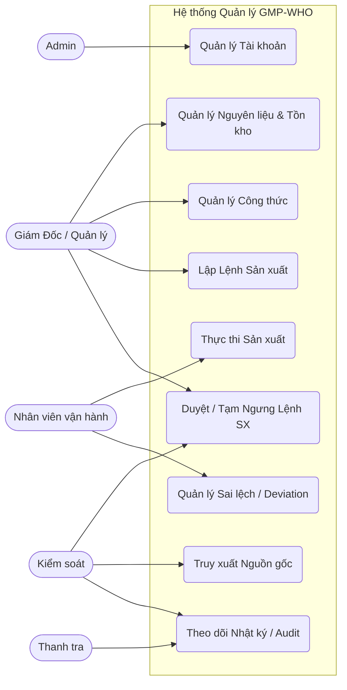
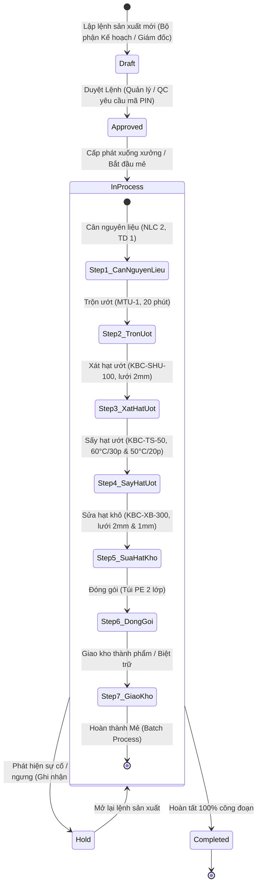
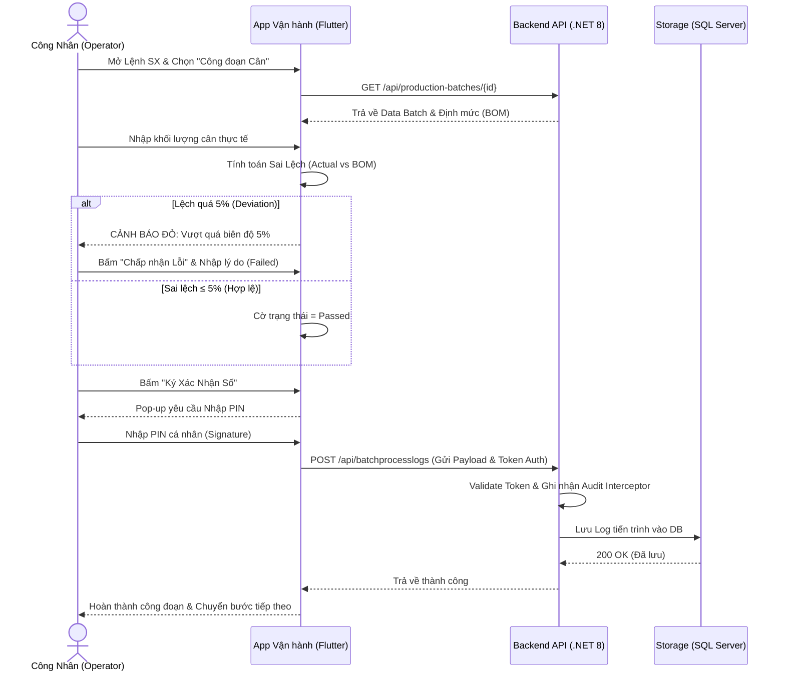
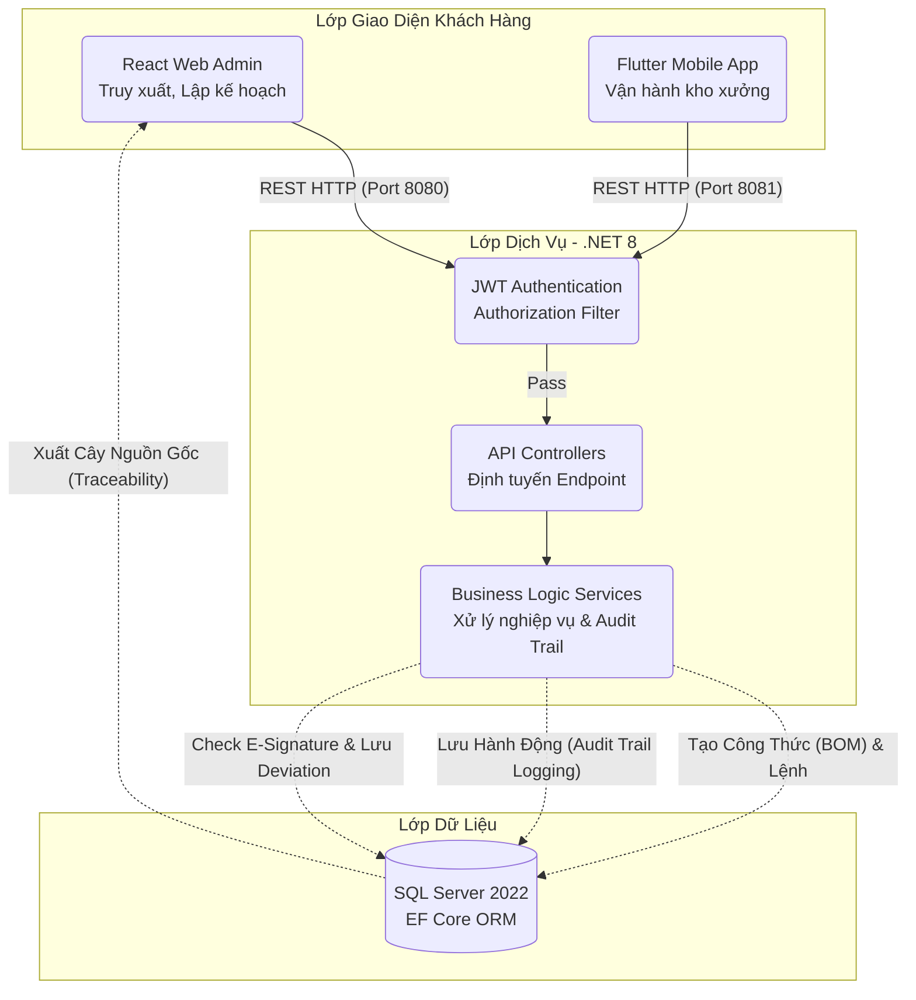

# Sơ Đồ Quy Trình Nghiệp Vụ - GMP WHO System

Dựa trên bộ codebase hiện tại, dưới đây là hệ thống các sơ đồ mô phỏng kiến trúc, luồng dữ liệu, tương tác tác nhân và quy trình nghiệp vụ thực tế.

## 1. Sơ đồ Use Case (Tác nhân & Phân quyền)

Bản đồ phân tầng đặc quyền của các tác nhân (Actors) đối với các Module trong hệ thống. Hệ thống xoay quanh nguyên tắc "Phân quyền tối thiểu" (Least Privilege) của GMP.

---

## 2. Sơ đồ Trạng thái (Luồng Đời sống của Lệnh Sản Xuất)

Quy trình biến đổi logic từ lúc lên kế hoạch (Draft) cho tới khi chốt sổ (Completed). Mọi thao tác chuyển trạng thái quan trọng đều buộc phải qua xác thực chữ ký (Mã PIN).

---

## 3. Sơ đồ Tuần tự (Sequence Diagram - Thực thi công đoạn Mobile)

Ví dụ điển hình nhất trong quá trình vận hành sản xuất: Một Công nhân (Operator) thực hiện công đoạn Cân nguyên liệu.

---

## 4. Tiêu chuẩn Môi trường và Máy móc (Phòng Pha Chế / Sản Xuất)

Theo chuẩn GMP-WHO và thực tế dự án Sản xuất Cao Khô, hệ thống yêu cầu nhân viên phải thực hiện **Kiểm tra môi trường** (Use-case Kiểm tra môi trường) trước khi tiến hành sản xuất. Các thông số cần đáp ứng:
- **Nhiệt độ phòng:** $21^\circ\text{C} - 25^\circ\text{C}$
- **Độ ẩm:** $45\% - 70\%$
- **Áp lực phòng:** $\ge 10 \text{ Pa}$
- **Tình trạng vệ sinh:** Đảm bảo sạch sẽ, không có rác thải.

Các thiết bị, máy móc cần được kiểm tra tình trạng hoạt động bao gồm:
- Cân điện tử IW2-60
- Máy trộn ướt MTU-1
- Máy xát hạt ướt KBC-SHU-100
- Máy sấy tầng sôi KBC-TS-50
- Máy sửa hạt khô KBC-XB-300

---

## 5. Kiến trúc và Luồng Dữ Liệu Hệ Thống (Data Flow)

Cấu trúc kiến trúc vật lý và sơ đồ giao tiếp Client-Server của toàn hệ thống.

