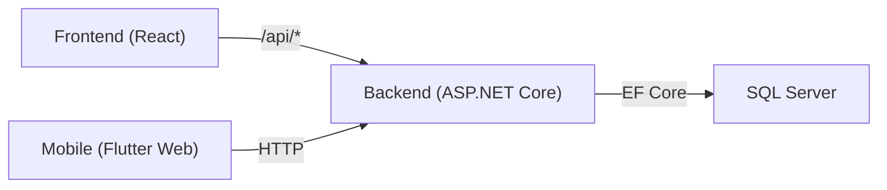

# Codebase Review — GMP System (DoAnTotNghiep)

## Tổng quan kiến trúc

Hệ thống gồm **4 thành phần** chạy trong Docker:

| Service | Công nghệ | Cổng | Mô tả |
|---|---|---|---|
| `gmp-sqlserver` | MS SQL Server 2022 | 1434 | Database chính |
| `gmp-api` | ASP.NET Core (.NET) | 5001 | REST API backend |
| `gmp-frontend` | React + Vite + TypeScript + Tailwind | 8080 | Web admin |
| `gmp-mobile` | Flutter (web build) | 8081 | App cho sàn sản xuất |



---

## Backend — ASP.NET Core (`GMP_System`)

### Kiến trúc
- **Pattern**: Repository + Unit of Work
- **ORM**: Entity Framework Core (Code-First + `EnsureCreated`)
- **14 Controllers**, **1 GenericRepository**, **1 UnitOfWork**, **1 AuditLogInterceptor**

### Điểm tốt ✅
- [AuditLogInterceptor](file:///c:/Users/Nguyen%20Minh%20Tri/.openclaw/workspace/DoAnTotNghiep/GMP_System/GMP_System/Interceptors/AuditLogInterceptor.cs#8-95) bắt toàn bộ INSERT/UPDATE/DELETE automatically, serialize sang JSON — rất chuẩn GMP.
- `ReferenceHandler.IgnoreCycles` ngăn vòng lặp JSON hiệu quả.
- `EnsureCreated` + seed data trong [Program.cs](file:///c:/Users/Nguyen%20Minh%20Tri/.openclaw/workspace/DoAnTotNghiep/GMP_System/GMP_System/Program.cs) → dễ bootstrap môi trường mới.
- CORS được cấu hình tập trung.
- `healthcheck` endpoint đầy đủ cho Docker.

### Vấn đề & rủi ro ⚠️

#### 1. Không có Authentication / Authorization
```csharp
// Program.cs — không có app.UseAuthentication()
app.UseAuthorization(); // Chỉ có Authorization nhưng không có Auth middleware
```
> Tất cả API endpoint **hoàn toàn mở**, bất kỳ ai cũng có thể gọi. [AuditLogInterceptor](file:///c:/Users/Nguyen%20Minh%20Tri/.openclaw/workspace/DoAnTotNghiep/GMP_System/GMP_System/Interceptors/AuditLogInterceptor.cs#8-95) hardcode `ChangedBy = 1`.

#### 2. [GenericRepository](file:///c:/Users/Nguyen%20Minh%20Tri/.openclaw/workspace/DoAnTotNghiep/GMP_System/GMP_System/Repositories/GenericRepository.cs#12-17) không có `Include` → Navigation Properties luôn null
```csharp
// GenericRepository.cs
public async Task<IEnumerable<T>> GetAllAsync()
{
    return await _dbSet.ToListAsync(); // Không có .Include(...)
}
```
Ảnh hưởng trực tiếp đến [TraceabilityController](file:///c:/Users/Nguyen%20Minh%20Tri/.openclaw/workspace/DoAnTotNghiep/GMP_System/GMP_System/Controllers/TraceabilityController.cs#8-132) — dựa vào `targetBatch.Order`, `order.Recipe`, `u.InventoryLot.Material` nhưng **chúng sẽ là null** vì lazy loading không được bật.

#### 3. [TraceabilityController](file:///c:/Users/Nguyen%20Minh%20Tri/.openclaw/workspace/DoAnTotNghiep/GMP_System/GMP_System/Controllers/TraceabilityController.cs#8-132) — Load toàn bộ bảng vào memory
```csharp
var batches = await _unitOfWork.ProductionBatches.GetAllAsync(); // Load toàn bộ
var materialUsages = await _unitOfWork.MaterialUsages.GetAllAsync(); // Load toàn bộ
```
Khi dữ liệu lớn sẽ gây tràn memory. Cần dùng `Where(...)` trực tiếp trên DB.

#### 4. [ProductionBatchesController](file:///c:/Users/Nguyen%20Minh%20Tri/.openclaw/workspace/DoAnTotNghiep/GMP_System/GMP_System/Controllers/ProductionBatchesController.cs#7-119) — Comment-out logic quan trọng
```csharp
// _unitOfWork.ProductionOrders.Update(order); // (Bỏ comment dòng này nếu Repository có hàm Update)
```
Order cha không được update status khi Batch bắt đầu.

#### 5. `MaterialsController.Update` — Không map đủ trường
```csharp
existingMaterial.MaterialCode = material.MaterialCode;
existingMaterial.MaterialName = material.MaterialName;
existingMaterial.Type = material.Type;
// existingMaterial.Description = material.Description; // Đang bị comment out
```

#### 6. [RecipesController](file:///c:/Users/Nguyen%20Minh%20Tri/.openclaw/workspace/DoAnTotNghiep/GMP_System/GMP_System/Controllers/RecipesController.cs#7-74) — [GetAll](file:///c:/Users/Nguyen%20Minh%20Tri/.openclaw/workspace/DoAnTotNghiep/GMP_System/GMP_System/Controllers/ProductionBatchesController.cs#18-25) không trả về BOM
```csharp
// Lưu ý: GenericRepository chỉ lấy bảng chính. Để lấy cả BOM... (TODO comment)
var recipes = await _unitOfWork.Recipes.GetAllAsync();
```
Frontend muốn xem BOM của Recipe nhưng API không trả về.

#### 7. `EnsureCreated` không phù hợp cho production
`db.Database.EnsureCreated()` không chạy migrations, nếu schema thay đổi sẽ không cập nhật tự động.

#### 8. CORS thiếu các origin quan trọng
```csharp
policy.WithOrigins(
    "http://localhost:8080",
    "http://100.89.137.3:8080"  // IP Tailscale hardcode
)
```
Mobile app (port 8081) và HTTPS không được phép.

#### 9. Thiếu controller cho một số API mà frontend gọi
Frontend [api.ts](file:///c:/Users/Nguyen%20Minh%20Tri/.openclaw/workspace/DoAnTotNghiep/PharmaceuticalProcessingManagementSystem/PharmaceuticalProcessingManagementSystem/src/services/api.ts) gọi các endpoint sau nhưng backend **không có controller tương ứng**:
- `POST /auth/login`, `GET /auth/me`
- `GET /inventory-lots`
- `GET /audit-logs`
- `POST /production-batches/{id}/start`, `POST /production-batches/{id}/complete`
- `GET /batch-process-logs/{id}/complete`

---

## Frontend — React + TypeScript (`PharmaceuticalProcessingManagementSystem`)

### Kiến trúc
- **Stack**: Vite + React + TypeScript + Tailwind CSS + TanStack Query
- **Routing**: React Router v6 (10 pages)
- **API layer**: Axios với interceptors — tập trung trong [api.ts](file:///c:/Users/Nguyen%20Minh%20Tri/.openclaw/workspace/DoAnTotNghiep/PharmaceuticalProcessingManagementSystem/PharmaceuticalProcessingManagementSystem/src/services/api.ts)

### Điểm tốt ✅
- Tổ chức tốt: `pages/`, `services/`, `components/`, `types/`
- Sử dụng TanStack Query (React Query) cho data fetching — quản lý cache tốt
- `axios` interceptor tự động đọc token từ localStorage

### Vấn đề & rủi ro ⚠️

#### 1. API URL mismatch
[api.ts](file:///c:/Users/Nguyen%20Minh%20Tri/.openclaw/workspace/DoAnTotNghiep/PharmaceuticalProcessingManagementSystem/PharmaceuticalProcessingManagementSystem/src/services/api.ts) gọi endpoint `/inventory-lots` nhưng backend controller có route là `api/InventoryLots` (controller name-based routing).

#### 2. `PaginatedResponse` type mismatch
Frontend expect `productionOrdersApi.getAll()` trả về `PaginatedResponse<ProductionOrder>` (có `totalCount`, `pageNumber`...) nhưng backend chỉ trả về `{ data, totalCount, success, message }` — thiếu `pageNumber`, `pageSize`.

#### 3. Auth flow không đầy đủ
`authApi.login()` được định nghĩa nhưng không có trang Login, không có guard route, không có refresh token logic.

#### 4. Type `any` quá nhiều
```typescript
export const appUsersApi = {
  create: (data: any) => ...  // ❌
  update: (id: number, data: any) => ...  // ❌
```

---

## Mobile App — Flutter (`MobileApp`)

### Kiến trúc
- Flutter multi-platform (Android, iOS, Web, Windows, Linux, macOS)
- Build web deploy vào Docker nginx

### Điểm tốt ✅
- Cấu trúc rõ ràng: `screens/`, `services/`, `components/`, `theme/`
- Style nhất quán với `Theme.of(context).primaryColor`
- Có Dockerfile và nginx.conf

### Vấn đề & rủi ro ⚠️

#### 1. UI hoàn toàn static — không kết nối API
[BatchDashboardScreen](file:///c:/Users/Nguyen%20Minh%20Tri/.openclaw/workspace/DoAnTotNghiep/MobileApp/lib/screens/batch_dashboard_screen.dart#5-110) render **hardcode 4 bước cố định**:
```dart
_buildStepItem(context, 'Step 1: Xử lý nguyên liệu - Sấy TD 8', 'Completed'),
_buildStepItem(context, 'Step 2: ...', 'Pending'),
// ... Không có HTTP call nào
```

#### 2. Navigation chưa có logic điều hướng thực sự
`onTap: status == 'Locked' ? null : () {}` — hàm rỗng, không navigate sang màn hình chi tiết.

#### 3. Chưa rõ `services/` layer kết nối gì
Cần kiểm tra `lib/services/` để xác minh có HTTP service không hay chỉ là placeholder.

---

## Database — SQL Scripts (`DATABASE/`)

### Điểm tốt ✅
- Schema được tổ chức tốt theo module (UserManagement, ProcessDefinition, ProductionExecution...)
- Có triggers GMP quan trọng: `trg_Prevent_Edit_Approved_Recipe`, `trg_Check_Material_QC`, `trg_Check_Equipment_Status`
- Có [AuditTrail.sql](file:///c:/Users/Nguyen%20Minh%20Tri/.openclaw/workspace/DoAnTotNghiep/DATABASE/AuditTrail.sql), [Immutability.sql](file:///c:/Users/Nguyen%20Minh%20Tri/.openclaw/workspace/DoAnTotNghiep/DATABASE/Immutability.sql) — đảm bảo tính bất biến theo chuẩn GMP
- Seed data ([capsule_seed.sql](file:///c:/Users/Nguyen%20Minh%20Tri/.openclaw/workspace/DoAnTotNghiep/DATABASE/capsule_seed.sql), [pharmacy_seed.sql](file:///c:/Users/Nguyen%20Minh%20Tri/.openclaw/workspace/DoAnTotNghiep/DATABASE/pharmacy_seed.sql)) đa dạng

### Vấn đề ⚠️
- [init.sql](file:///c:/Users/Nguyen%20Minh%20Tri/.openclaw/workspace/DoAnTotNghiep/DATABASE/init.sql) và seed scripts không được tự động chạy khi Docker khởi động (backend dùng `EnsureCreated` thay vì chạy SQL)
- Có sự **không đồng bộ** giữa schema SQL và EF Code-First ([GmpContext.cs](file:///c:/Users/Nguyen%20Minh%20Tri/.openclaw/workspace/DoAnTotNghiep/GMP_System/GMP_System/Entities/GmpContext.cs)) — nếu chạy cả 2, schema có thể xung đột.

---

## Docker & Infrastructure

### Điểm tốt ✅
- Healthcheck đầy đủ cho SQL Server và API
- `depends_on` với `condition: service_healthy` — đúng chuẩn
- Volume persistent cho SQL data
- Sử dụng external network `gmp-network`

### Vấn đề ⚠️

#### 1. SA Password lộ trong [docker-compose.yml](file:///c:/Users/Nguyen%20Minh%20Tri/.openclaw/workspace/DoAnTotNghiep/docker-compose.yml)
```yaml
- SA_PASSWORD=GMP_Strong@Passw0rd123
- ConnectionStrings__DefaultConnection=Server=...Password=GMP_Strong@Passw0rd123;...
```
Nên dùng Docker Secrets hoặc `.env` file (đã có [.env.example](file:///c:/Users/Nguyen%20Minh%20Tri/.openclaw/workspace/DoAnTotNghiep/PharmaceuticalProcessingManagementSystem/PharmaceuticalProcessingManagementSystem/.env.example)).

#### 2. `VITE_API_URL` set cả ở `args` lẫn `environment`
```yaml
args:
  - VITE_API_URL=/api   # Build-time → đúng cho Vite
environment:
  - VITE_API_URL=/api   # Runtime → không có tác dụng với Vite static build
```

#### 3. Mobile app (port 8081) không có trong CORS whitelist của API

---

## Tóm tắt ưu tiên sửa

| # | Mức độ | Vấn đề | Module |
|---|---|---|---|
| 1 | 🔴 Critical | Navigation properties null do không có `Include` | Backend |
| 2 | 🔴 Critical | Thiếu Auth/Login — API mở hoàn toàn | Backend + Frontend |
| 3 | 🔴 Critical | Mobile UI hoàn toàn static, không gọi API | Mobile |
| 4 | 🟠 High | Frontend gọi endpoint không tồn tại ở backend | Backend + Frontend |
| 5 | 🟠 High | N+1 query / load toàn bảng trong Traceability | Backend |
| 6 | 🟡 Medium | Password hardcode trong docker-compose | Docker |
| 7 | 🟡 Medium | `Description` field bị comment-out trong Update | Backend |
| 8 | 🟡 Medium | `EnsureCreated` vs SQL scripts không đồng bộ | Backend/DB |
| 9 | 🟡 Medium | CORS thiếu port 8081 (Mobile) | Backend |
| 10 | 🟢 Low | Type `any` nhiều trong api.ts | Frontend |
