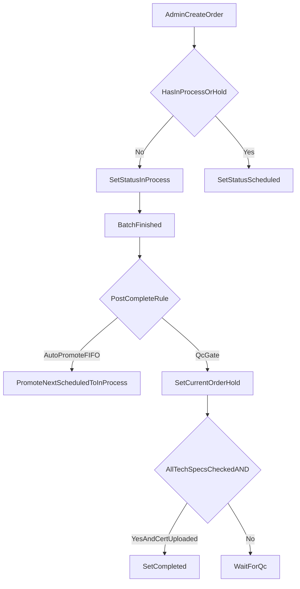

# Kế hoạch cập nhật nghiệp vụ GMP-WHO

## Phạm vi mục tiêu
Cập nhật backend, frontend và dữ liệu seed để khớp đúng nghiệp vụ bạn yêu cầu: loại trừ nguyên liệu Packaging khỏi tỷ lệ/khối lượng công thức, kiểm soát QC trước upload giấy kiểm nghiệm, chuẩn hóa trạng thái lệnh sản xuất theo queue, tinh gọn giao diện theo dõi tiến độ, cố định dữ liệu lệnh sau khi lập, và ràng buộc xóa thành phẩm.

## 1) Công thức (Recipe)
- Cập nhật logic tính BOM để **không tính nguyên liệu có `Materials.Type = 'Packaging'`** (bao gồm “Vỏ nang cứng”) trong:
  - tỷ lệ công thức
  - khối lượng tính toán
- Áp dụng nhất quán tại backend API và frontend hiển thị liên quan BOM trong:
  - [D:/codes/Codex/DoAnTotNghiep/GMP_System/GMP_System/Controllers/RecipesController.cs](D:/codes/Codex/DoAnTotNghiep/GMP_System/GMP_System/Controllers/RecipesController.cs)
  - [D:/codes/Codex/DoAnTotNghiep/PharmaceuticalProcessingManagementSystem/PharmaceuticalProcessingManagementSystem/src/pages/Recipes.tsx](D:/codes/Codex/DoAnTotNghiep/PharmaceuticalProcessingManagementSystem/PharmaceuticalProcessingManagementSystem/src/pages/Recipes.tsx)
  - [D:/codes/Codex/DoAnTotNghiep/PharmaceuticalProcessingManagementSystem/PharmaceuticalProcessingManagementSystem/src/services/api.ts](D:/codes/Codex/DoAnTotNghiep/PharmaceuticalProcessingManagementSystem/PharmaceuticalProcessingManagementSystem/src/services/api.ts)
- Xóa checkbox trong phần Công thức (Recipe màn hình quản trị) để tránh thao tác QC sai ngữ cảnh.
- Giữ checkbox tiêu chuẩn kỹ thuật chỉ cho luồng QC Mobile khi lệnh đã hoàn thành công đoạn sản xuất.
- Cập nhật API xóa công đoạn để tự **đánh lại `StepNumber` liên tục** sau khi xóa một bước:
  - [D:/codes/Codex/DoAnTotNghiep/GMP_System/GMP_System/Controllers/RecipesController.cs](D:/codes/Codex/DoAnTotNghiep/GMP_System/GMP_System/Controllers/RecipesController.cs)
- Loại bỏ thuộc tính `MaterialId` khỏi `RecipeRouting` và dùng `MaterialIds` làm nguồn chính:
  - [D:/codes/Codex/DoAnTotNghiep/GMP_System/GMP_System/Entities/RecipeRouting.cs](D:/codes/Codex/DoAnTotNghiep/GMP_System/GMP_System/Entities/RecipeRouting.cs)
  - [D:/codes/Codex/DoAnTotNghiep/GMP_System/GMP_System/Entities/GmpContext.cs](D:/codes/Codex/DoAnTotNghiep/GMP_System/GMP_System/Entities/GmpContext.cs)
  - các API tạo/sửa routing và SQL seed liên quan.

## 2) QC kiểm nghiệm + upload giấy kiểm nghiệm (điều kiện AND)
- Thiết kế lại điều kiện upload chứng từ kiểm nghiệm:
  - chỉ role QC
  - chỉ khi lệnh/batch đủ điều kiện nghiệp vụ QC
  - chỉ cho upload khi **toàn bộ checkbox tech spec đạt (AND)**
- Di chuyển điểm thao tác checkbox/duyệt từ Recipe admin sang màn hình QC (Mobile flow/API).
- Bổ sung kiểm tra ở backend (không chỉ chặn ở UI) để đảm bảo không thể upload bypass:
  - [D:/codes/Codex/DoAnTotNghiep/GMP_System/GMP_System/Controllers/ProductionOrdersController.cs](D:/codes/Codex/DoAnTotNghiep/GMP_System/GMP_System/Controllers/ProductionOrdersController.cs)
  - controller upload certificate hiện có (qua API certificate/batch).
- Đồng bộ frontend upload hành vi theo trạng thái khóa/mở điều kiện QC:
  - [D:/codes/Codex/DoAnTotNghiep/PharmaceuticalProcessingManagementSystem/PharmaceuticalProcessingManagementSystem/src/pages/ProductionOrders.tsx](D:/codes/Codex/DoAnTotNghiep/PharmaceuticalProcessingManagementSystem/PharmaceuticalProcessingManagementSystem/src/pages/ProductionOrders.tsx)

## 3) Lệnh sản xuất (Production Orders) + Queue trạng thái
- Bỏ khởi tạo `Draft` mặc định theo luồng tạo lệnh mới.
- Khi tạo lệnh:
  - nếu chưa có lệnh `In-Process` hoặc `Hold` đang tồn tại => lệnh mới vào `In-Process`
  - nếu đã có => lệnh mới vào `Scheduled`
- Bổ sung cấu hình trên mỗi lệnh do Admin chọn cho hậu xử lý sau khi batch hoàn tất:
  - **Auto promote FIFO**: tự đẩy lệnh `Scheduled` kế tiếp lên `In-Process`
  - **QC gate**: lệnh vừa xong chuyển `Hold`, chỉ khi QC đạt điều kiện mới chuyển `Completed`
- Cập nhật logic transition tương ứng tại:
  - [D:/codes/Codex/DoAnTotNghiep/GMP_System/GMP_System/Controllers/ProductionOrdersController.cs](D:/codes/Codex/DoAnTotNghiep/GMP_System/GMP_System/Controllers/ProductionOrdersController.cs)
  - [D:/codes/Codex/DoAnTotNghiep/PharmaceuticalProcessingManagementSystem/PharmaceuticalProcessingManagementSystem/src/pages/ProductionOrders.tsx](D:/codes/Codex/DoAnTotNghiep/PharmaceuticalProcessingManagementSystem/PharmaceuticalProcessingManagementSystem/src/pages/ProductionOrders.tsx)

## 4) Theo dõi tiến độ (Manager Operations UI)
- Gộp thông tin trạng thái từng bước vào cột “Bước” trong bảng “CÔNG THỨC VÀ CÁC CÔNG ĐOẠN”, giảm rườm rà phần “Tiến độ sản xuất”.
- Tối ưu hiển thị cột `Khu vực`, `Thời gian cài đặt`, `Mô tả` dạng gọn theo nội dung (CSS + render text truncation hợp lý):
  - [D:/codes/Codex/DoAnTotNghiep/PharmaceuticalProcessingManagementSystem/PharmaceuticalProcessingManagementSystem/src/pages/ManagerOperations.tsx](D:/codes/Codex/DoAnTotNghiep/PharmaceuticalProcessingManagementSystem/PharmaceuticalProcessingManagementSystem/src/pages/ManagerOperations.tsx)

## 5) Cố định dữ liệu lệnh sau khi đã lập
- Đảm bảo khi `ProductionOrder` đã tạo thì thay đổi Recipe sau này **không ảnh hưởng lệnh đã lập**.
- Hoàn thiện snapshot cho phần chưa cố định hiện tại (routing/tech specs), không chỉ BOM:
  - tạo/cập nhật bản sao theo `OrderId`
  - các API đọc chạy lệnh luôn ưu tiên snapshot theo lệnh
- Điểm chạm chính:
  - [D:/codes/Codex/DoAnTotNghiep/GMP_System/GMP_System/Controllers/ProductionOrdersController.cs](D:/codes/Codex/DoAnTotNghiep/GMP_System/GMP_System/Controllers/ProductionOrdersController.cs)
  - [D:/codes/Codex/DoAnTotNghiep/GMP_System/GMP_System/Controllers/RecipesController.cs](D:/codes/Codex/DoAnTotNghiep/GMP_System/GMP_System/Controllers/RecipesController.cs)
  - [D:/codes/Codex/DoAnTotNghiep/GMP_System/GMP_System/Entities/RecipeTechSpec.cs](D:/codes/Codex/DoAnTotNghiep/GMP_System/GMP_System/Entities/RecipeTechSpec.cs)

## 6) Thành phẩm (Finished products)
- Cho phép xóa thành phẩm đầu ra mặc định.
- Chặn xóa nếu thành phẩm đó gắn với công thức đang có lệnh ở trạng thái hoạt động/lập lịch theo rule bạn muốn bảo vệ.
- Cập nhật tại:
  - [D:/codes/Codex/DoAnTotNghiep/GMP_System/GMP_System/Controllers/MaterialsController.cs](D:/codes/Codex/DoAnTotNghiep/GMP_System/GMP_System/Controllers/MaterialsController.cs)

## 7) Đồng bộ SQL seed theo DB hiện tại (SSMS)
- Cập nhật `RecipeTechSpecs` trong file seed theo schema thực tế DB hiện tại (bao gồm các cột đang dùng runtime như `OrderId` nếu đã có trong DB):
  - [D:/codes/Codex/DoAnTotNghiep/DATABASE/full_seed.sql](D:/codes/Codex/DoAnTotNghiep/DATABASE/full_seed.sql)
- Đồng bộ seed `RecipeRouting` theo quyết định bỏ `MaterialId`, chỉ dùng `MaterialIds`.
- Chuẩn hóa dữ liệu trạng thái lệnh trong seed tránh lệch `InProcess`/`In-Process`.

## 8) An toàn dữ liệu + UTF-8
- Giữ nguyên tiếng Việt có dấu và encoding UTF-8 xuyên suốt file TSX/CS/SQL.
- Kiểm thử nhanh các màn hình có tiếng Việt để tránh lỗi font/hiển thị sau chỉnh sửa.

## Luồng trạng thái mục tiêu (rút gọn)

## Thứ tự triển khai
1. Backend rule + entity/schema (status, snapshot, routing/material field, delete guards)
2. Frontend UI/UX (checkbox relocation, upload gating, progress table simplification)
3. SQL seed alignment (`full_seed.sql`)
4. Regression test nhanh theo các luồng nghiệp vụ chính

## Tiêu chí nghiệm thu
- Packaging không tham gia tỷ lệ/khối lượng công thức.
- Không còn checkbox QC trong màn hình Công thức admin.
- Upload giấy kiểm nghiệm chỉ mở khi QC đạt toàn bộ checklist AND.
- Tạo lệnh mới tuân thủ `In-Process`/`Scheduled` theo queue.
- Xóa bước công thức tự đánh lại thứ tự chuẩn.
- RecipeRouting không còn `MaterialId` trong app/schema seed mục tiêu.
- Lệnh đã lập giữ nguyên dữ liệu dù Recipe gốc thay đổi về sau.
- Thành phẩm chỉ bị chặn xóa khi đang rơi vào điều kiện ràng buộc bạn nêu.
- Không phát sinh lỗi font tiếng Việt/UTF-8.