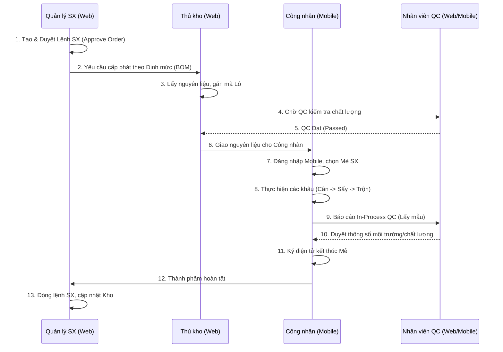
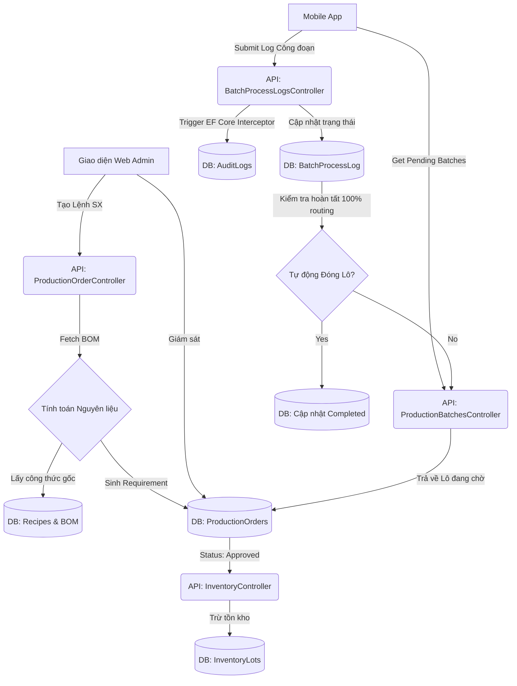

# Đánh giá & Kế hoạch phát triển hệ thống GMP-WHO

Dựa trên việc đối chiếu cấu trúc hiện tại của Codebase với Đề cương đồ án (DOCX) và các tài liệu đặc tả (PDF/Guild), dưới đây là đánh giá và kế hoạch hoàn thiện.

## 1. Đánh giá mức độ đáp ứng của Codebase hiện tại

**Đã đáp ứng:**
- **Nền tảng công nghệ:** Đã triển khai đa nền tảng đúng yêu cầu (Web Admin bằng React, Mobile bằng Flutter và Backend C# .NET 8).
- **Kiến trúc CSDL gốc:** Table Structure đã thiết kế bám sát tiêu chuẩn GMP-WHO (BOM đệ quy, quản lý Lô/Batch, Audit Trail, Traceability, Routing).
- **Nghiệp vụ nền tảng:** Mobile App đã lên khung cho các bước nhập liệu thực tế tại xưởng (Cân, Trộn, Sấy) với giao diện UX bám sát yêu cầu.

**Khuyết thiếu (Gap Analysis):**
- **Báo cáo thống kê:** Thiếu tính năng xuất báo cáo truy xuất nguồn gốc (Traceability Report) ra PDF/Excel cho auditor theo chuẩn GMP.
- **Phân quyền người dùng (Authorization):** Khung kiến trúc đã có nhưng Web Admin cần bổ sung Role-based UI (Ví dụ: Công nhân không thể truy cập Admin, QC chỉ được duyệt phiếu KN).
- **Module Web Admin cần hoàn thiện:** Front-end hiện tại đang thiếu các màn hình Create/Update chi tiết cho Recipe, BOM, Quản lý lô nguyên liệu và duyệt Lệnh sản xuất.
- **Tích hợp E2E:** Cần kết nối trơn tru luồng State Machine từ `Draft -> Approved -> Dispensed -> Produced` giữa Web và Mobile API.

---

## 2. Kế hoạch phát triển bổ sung chức năng

Để hệ thống hoàn toàn thỏa mãn mọi yêu cầu tốt nghiệp và chuẩn GMP, cần thực hiện 3 Phase sau:

### Phase 1: Hoàn thiện Web Admin & Phân quyền (Tuần 1-2)
- **Quản lý danh mục (Master Data CRUD):** Giao diện quản lý Nguyên liệu (Materials), Công thức (Recipes), và BOM đệ quy. 
- **Phân quyền Role-based:** Implement JWT Auth Roles phân rạch ròi 4 cấp: `Admin`, `ProductionManager`, `QC`, `Operator`. Menu trên web sẽ thay đổi theo role.
- **Quản lý Lệnh sản xuất:** Bổ sung luồng duyệt (Approve) lệnh sản xuất, kích hoạt hệ thống tự động tính toán số lượng nguyên liệu theo BOM.

### Phase 2: Hoàn thiện Mobile App & Tích hợp (Tuần 3)
- **Tích hợp API:** Nối API hoàn chỉnh cho các màn hình `Cân`, `Trộn`, `Sấy` để nén dữ liệu đẩy lên `BatchProcessLogs`.
- **Validation:** Bật cờ cảnh báo (Deviation) nếu sai lệch khối lượng > 5% theo định mức lý thuyết.
- **Digital Signature:** Xác thực bằng mã PIN/Password nội bộ ứng dụng trước khi operator "Hoàn thành công đoạn".

### Phase 3: Báo cáo Thống kê & Audit Trail (Tuần 4)
- **Tính năng Traceability:** Giao diện dạng Cây (Tree-view) truy xuất phả hệ từ Lô thành phẩm trả về Lô nguyên liệu gốc.
- **Xuất PDF:** Cho phép export Phiếu kiểm soát lô (Batch Record) ra định dạng file cứng.
- **Màn hình Audit Logs:** Giao diện cho Auditor xem lịch sử thay đổi (Chỉ đọc) để bảo đảm Data Integrity.

---

## 3. Sơ đồ Quy trình (Process Models)

### 3.1. Quy trình Nghiệp vụ Sản xuất (Business Process)

Tập trung vào 4 tác nhân chính: **Quản lý sản xuất**, **Thủ kho**, **Công nhân (Operator)**, và **Chất lượng (QC)**.

### 3.2. Quy trình Hệ thống & Luồng Dữ liệu (System Data Flow)

Mô tả cách thức các thực thể (Entity) tương tác và trạng thái máy (State Machine) thay đổi trong Backend.

